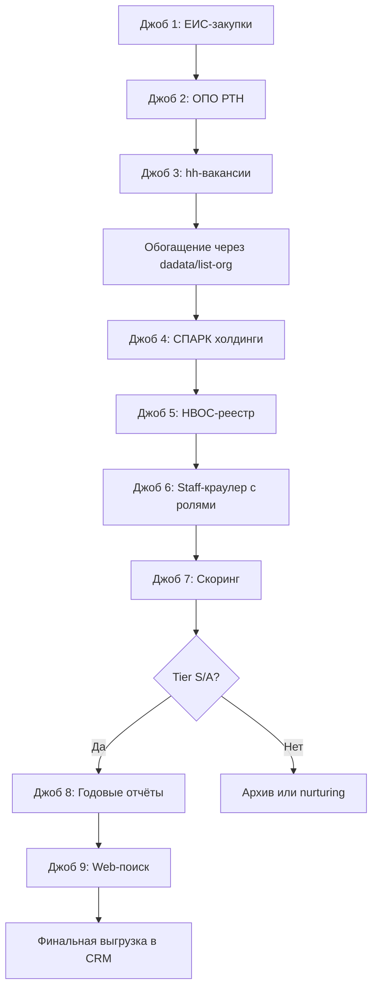

# Центробежные компрессоры: план сбора самой ценной базы контактов

*Сгенерировано через провайдер (claude-fable-5), 6 линз + синтез*

## СВЕДЁННЫЙ ПЛАН

# Сводный план: от исследования к действию

## 1. ТОП-источники (ранжированы ценность/трудоёмкость)

### Tier S — запускать первым делом

| Источник | Ценность | Трудоёмкость | Что даёт |
|----------|----------|--------------|----------|
| **Закупки ЕИС** | 10/10 | Средняя | Горячие лиды + ЛПР-контакты + марки оборудования |
| **Реестр ОПО РТН** | 9/10 | Средняя | Подтверждение оборудования + география активов |
| **Вакансии hh.ru** | 8/10 | Низкая | Активная эксплуатация + структура служб |

### Tier A — подключать после отладки первых

| Источник | Ценность | Трудоёмкость | Что даёт |
|----------|----------|--------------|----------|
| **Сайты (страницы Сотрудники)** | 8/10 | Низкая (уже есть) | Прямые контакты ЛПР |
| **Холдинговые деревья (СПАРК)** | 7/10 | Средняя | Полнота охвата группы |
| **НВОС I категории** | 6/10 | Низкая | Крупные промплощадки |

### Tier B — расширение базы

| Источник | Ценность | Трудоёмкость |
|----------|----------|--------------|
| **Годовые отчёты ПАО** | 6/10 | Высокая |
| **Лицензии РТН** | 5/10 | Средняя |
| **xmlriver веб-поиск** | 5/10 | Средняя |

**Приоритет внедрения:**
```
НЕДЕЛЯ 1-2: ЕИС-парсер + ОПО-парсер + hh-скан
НЕДЕЛЯ 3: Интеграция СПАРК API (холдинги)
НЕДЕЛЯ 4: НВОС-реестр + улучшение staff-краулера
МЕСЯЦ 2: Годовые отчёты + расширенный веб-поиск
```

---

## 2. Целевой список: с чего начать

### Холдинги-ядро (приоритет 1)

**Газовая отрасль:**
- Газпром (дочки: Газпром трансгаз [все филиалы], Газпром добыча [Уренгой/Надым/Ямбург/Оренбург/Астрахань], Газпром переработка)
- Новатэк (Ямал СПГ, Арктик СПГ, Портэнерго)
- ЛУКОЙЛ (добывающие дочки)
- Роснефть (РН-Юганскнефтегаз, РН-Пурнефтегаз, Самотлорнефтегаз)
- Татнефть (НГДУ, Татнефть-Нефтехим)

**Химия и удобрения:**
- ФосАгро (Балаковские удобрения, Череповецкий Азот, Апатит)
- Уралхим (Кирово-Чепецкий, Воскресенские минудобрения, Пермские минудобрения)
- Акрон (Великий Новгород, Дорогобуж)
- ЕвроХим (Невинномысский Азот, ЕвроХим-БМУ, Фосфорит)

**Нефтехимия:**
- СИБУР (Тобольск-Полимер, Томскнефтехим, Нижнекамскнефтехим, Воронежсинтезкаучук)
- ТАИФ (ТАНЕКО, Нижнекамский НПЗ)
- САФМАР (Уфаоргсинтез, Салаватнефтеоргсинтез)

**Металлургия:**
- НЛМК (Липецк, Алтай-Кокс, Стойленский ГОК)
- Северсталь (Череповец, ККХ)
- ММК (Магнитогорск, МКК)
- Евраз (ЗСМК, НТМК)

**Промышленные газы:**
- Линде Газ Рус
- Мессер
- Криогенмаш
- СибКриоГаз

### Отрасли-ядро (для массовой выгрузки по ОКВЭД)

1. **06.10 + 06.20** (добыча нефти/газа) — порог выручки 500 млн ₽
2. **49.50.21** (транспорт газа) — все компании
3. **19.20** (НПЗ) — все крупные
4. **20.14 + 20.15 + 20.16 + 20.17** (нефтехимия, удобрения, полимеры) — порог 1 млрд ₽
5. **20.11** (промгазы) — все
6. **24.10** (металлургия) — порог 1,5 млрд ₽
7. **37.00** (водоканалы) — порог 100 млн ₽, но обязательно сверка с ОПО/закупками

---

## 3. Роли-ЛПР: финальный канон под ЦБК

### Топ-10 ролей (приоритет для outreach)

| # | Роль | Код | Приоритет | Когда контактировать |
|---|------|-----|-----------|---------------------|
| 1 | Главный механик | `chief_mechanic` | ★★★★★ | Всегда первым, владелец парка |
| 2 | Главный энергетик | `chief_power_engineer` | ★★★★★ | Если компрессоры в энергоцехе (водоканалы, воздух) |
| 3 | Начальник компрессорной станции/цеха | `compressor_chief` | ★★★★★ | Газотранспорт, промыслы — прямой эксплуатант |
| 4 | Технический директор | `technical_director` | ★★★★☆ | Стратегические решения, модернизация |
| 5 | Директор по эксплуатации/надёжности | `maintenance_director` | ★★★★☆ | Крупные холдинги, программы замены оборудования |
| 6 | Зам. главного механика/энергетика | `deputy_chief_mechanic` | ★★★☆☆ | Если главмех недоступен |
| 7 | Начальник службы главного механика | `maintenance_head` | ★★★☆☆ | Координатор ремонтов |
| 8 | Инженер по надёжности/эксплуатации | `reliability_engineer` | ★★☆☆☆ | Подготовка ТЗ, дефектовка |
| 9 | Начальник отдела закупок/МТО | `procurement_head` | ★★☆☆☆ | Процедурный владелец, но не техническое решение |
| 10 | Генеральный директор | `ceo` | ★★☆☆☆ | Малые компании или финальный апрув |

### Дополнительные роли (15 в полном списке)

11. Начальник РМЦ (`repair_shop_head`)
12. Начальник установки (НПЗ/нефтехимия) (`plant_manager`)
13. Зам. директора по производству (`production_deputy`)
14. Менеджер по закупкам (`procurement_manager`)
15. Приёмная/секретариат (`reception`) — только для запроса контактов техслужб

**Правило best_for_outreach:**
- Если есть главмех/главэнерго/начальник КС → они в топ-3 автоматически
- Техдиректор попадает в топ-3, только если нет других технических ролей
- Закупки включаем в топ-3, только если технических контактов < 2
- Общий email (info@) никогда не попадает в best_for_outreach

---

## 4. Формула скоринга «центробеж-ценности»

### Псевдокод

```python
def calculate_cbk_score(company, contacts):
    score = 0
    
    # Блок 1: ОТРАСЛЕВАЯ РЕЛЕВАНТНОСТЬ (0-30)
    okved_scores = {
        '06.10': 30, '06.20': 30, '49.50.21': 30, '49.50.11': 30, '52.10.22': 30,  # Ядро А
        '19.20': 28, '20.14': 28, '20.15': 28, '20.16': 28, '20.17': 28,          # Ядро Б
        '20.11': 26, '24.10': 26, '19.10': 26,                                     # Ядро В
        '20.13': 20, '24.42': 20, '24.43': 20, '35.11': 20, '35.30': 20,          # Второй контур
        '37.00': 18, '36.00': 18,                                                  # Водоканалы
        '07.10': 15, '05.10': 15, '17.11': 15, '23.51': 15, '10.81': 15           # Периферия
    }
    score += max([okved_scores.get(okved, 0) for okved in company.okveds])
    
    # Блок 2: ФИНАНСОВАЯ СОСТОЯТЕЛЬНОСТЬ (0-20)
    revenue = company.revenue_mln_rub
    if company.okved_primary in ['37.00', '36.00']:  # Водоканалы — особый порог
        if revenue >= 1000: score += 20
        elif revenue >= 500: score += 15
        elif revenue >= 200: score += 10
        elif revenue >= 100: score += 5
    else:
        if revenue >= 10000: score += 20
        elif revenue >= 5000: score += 18
        elif revenue >= 2000: score += 15
        elif revenue >= 1000: score += 10
        elif revenue >= 500: score += 5
    
    if company.holding in TARGET_HOLDINGS:  # Газпром, СИБУР, Роснефть и т.д.
        score += 5
    score = min(score, 50)  # Cap блоков 1+2 = 50
    
    # Блок 3: ПОДТВЕРЖДЕНИЕ ОБОРУДОВАНИЯ (0-30)
    equipment_score = 0
    if company.has_rtn_opo: equipment_score += 15
    if company.has_purchases_cbk_3y: equipment_score += 12
    if company.has_rtn_license: equipment_score += 10
    if company.has_nvos_category_1: equipment_score += 8
    if company.has_vacancies_cbk: equipment_score += 8
    if company.has_annual_report_mention: equipment_score += 6
    if company.has_website_brand_mention: equipment_score += 5
    equipment_score = min(equipment_score, 30)
    score += equipment_score
    
    # Блок 4: КАЧЕСТВО КОНТАКТА (0-20)
    contact_scores = {
        'chief_mechanic': 20, 'chief_power_engineer': 20,
        'compressor_chief': 18, 'maintenance_director': 18,
        'technical_director': 16,
        'deputy_chief_mechanic': 14,
        'maintenance_head': 14,
        'reliability_engineer': 12,
        'procurement_head': 10,
        'ceo': 8,
        'reception': 3,
        'unknown': 2
    }
    
    best_contact_score = 0
    for contact in contacts:
        role_score = contact_scores.get(contact.role, 0)
        if contact.has_full_name: role_score += 3
        if contact.source_page == 'staff': role_score += 2
        if contact.has_mobile: role_score += 2
        role_score = min(role_score, 20)
        best_contact_score = max(best_contact_score, role_score)
    
    score += best_contact_score
    
    # МНОЖИТЕЛЬ: Горячий сегмент (импорт без сервиса)
    hot_multiplier = 1.0
    if (company.has_import_zip_purchases_2y or 
        company.website_mentions_import_substitution or
        company.vacancies_mention_import_brands):
        hot_multiplier = 1.3
    
    final_score = score * hot_multiplier
    return round(final_score, 1)
```

### Пороги отсечки

```python
def get_priority_tier(score):
    if score >= 90: return 'S'  # Немедленный персональный контакт
    if score >= 70: return 'A'  # Приоритетная обработка, неделя
    if score >= 50: return 'B'  # Плановая обработка, месяц
    if score >= 30: return 'C'  # Отложенная, nurturing
    return 'D'  # Архив
```

---

## 5. Правила подтверждения «именно центробеж» и анти-сигналы

### Сигналы-подтверждения (что искать)

**Прямые (вес 10/10):**
- Марки: К-250, ЦК, 32ВЦ, НЦ, ГПА-Ц, Siemens STC, Dresser-Rand, Baker Hughes, MAN RG, Elliott, Mitsubishi
- Технологические установки: ЭП (пиролиз), агрегат аммиака, ВРУ, каткрекинг, ДКС, СПГ
- Термины в закупках: "центробежный компрессор", "нагнетатель", "турбокомпрессор", "динамический компрессор"

**Косвенные (вес 7-9/10):**
- ОПО типа "компрессорная станция", "станция воздухоразделительная"
- Вакансии: "машинист технологических компрессоров", "машинист ГПА", "механик компрессорного цеха"
- Закупки специфичных узлов: "сменный ротор", "импеллер", "сухое газовое уплотнение (СГУ)", "антисрывная система"

### Анти-сигналы (фильтры отсечения)

**Исключить, если:**

| Анти-сигнал | Действие | Балл |
|-------------|----------|------|
| Только винтовые марки (Atlas Copco GA, Comprag, Dalgakiran) без упоминания центробежных | Исключить | -10 |
| Закупки содержат ТОЛЬКО "винтовой блок", "винтовая пара", "поршневая группа" | Исключить | -10 |
| Производительность в закупках до 50 м³/мин + давление до 10 бар | Понизить приоритет | -5 |
| Выручка < 300 млн (не водоканал) И нет ОПО И нет закупок ЦБК | Исключить | -15 |
| ОКВЭД 28.13/33.12 И роль в ЕИС = "исполнитель ремонтов" (конкурент) | В реестр конкурентов | — |
| ОКВЭД 68.32/70.10 И название содержит "УК"/"Управление" И нет ОПО | Исключить (управляшка) | -10 |

**Правило комбинированного скоринга:**
```
IF (сумма баллов подтверждения >= 10) THEN метка = "ЦЕНТРОБЕЖНЫЕ_ПОДТВЕРЖДЕНЫ"
ELSE IF (сумма > 0 И нет анти-сигналов) THEN метка = "ВОЗМОЖНО_ЦЕНТРОБЕЖНЫЕ"
ELSE IF (есть анти-сигналы) THEN метка = "НЕ_ЦБК" → исключить
```

---

## 6. Конкретные СЛЕДУЮЩИЕ ДЕЙСТВИЯ для пайплайна

### Неделя 1-2: Фундамент (горячие источники)

**Джоб 1: ЕИС-парсер закупок**
```python
# server/jobs/parse_eis_purchases.py
import requests
from datetime import datetime, timedelta

TARGET_KEYWORDS = [
    "центробежный компрессор", "нагнетатель", "ГПА", "турбокомпрессор",
    "К-250", "ЦК-", "Siemens", "Dresser", "Baker Hughes", "MAN",
    "воздуходувка ТВ", "компрессор пирогаза", "антисрывная система"
]

def run():
    # API zakupki.gov.ru
    for keyword in TARGET_KEYWORDS:
        results = search_eis(
            query=keyword,
            date_from=datetime.now() - timedelta(days=365*3),
            customer_inn=None  # Сначала общий поиск
        )
        for purchase in results:
            extract_customer_inn(purchase)
            extract_contact_person(purchase)  # ФИО, email, телефон
            extract_subject(purchase)  # Предмет закупки
            detect_brand(purchase.subject)  # Какая марка упоминается
            save_to_db(purchase, source='eis', marker='cbk_confirmed')
```

**Выгрузка:** 5-10 тыс. компаний с подтверждённой потребностью за 3 года

---

**Джоб 2: ОПО-парсер Ростехнадзора**
```python
# server/jobs/parse_rtn_opo.py
from playwright.sync_api import sync_playwright

def run():
    # Парсинг https://www.gosnadzor.ru/industrial/reestr/
    # Поиск по ключевым словам в названии ОПО
    TARGET_OPO_TYPES = [
        "компрессорная станция", "станция воздухоразделительная",
        "цех компрессии", "установка утилизации ПНГ", "ГПА"
    ]
    
    with sync_playwright() as p:
        browser = p.chromium.launch()
        page = browser.new_page()
        
        for region in REGIONS:  # Все регионы РФ
            page.goto(f"https://gosnadzor.ru/reestr?region={region}")
            for opo_type in TARGET_OPO_TYPES:
                results = page.query_selector_all(f"text={opo_type}")
                for result in results:
                    extract_company_inn()
                    extract_opo_address()
                    save_to_db(marker='opo_confirmed')
```

**Выгрузка:** 3-5 тыс. компаний с зарегистрированными ОПО

---

**Джоб 3: hh-скан вакансий**
```python
# server/jobs/parse_hh_vacancies.py
import requests

HH_API = "https://api.hh.ru/vacancies"
TARGET_POSITIONS = [
    "машинист компрессорных установок",
    "машинист технологических компрессоров",
    "машинист ГПА",
    "механик компрессорного цеха",
    "инженер по эксплуатации компрессорного оборудования"
]

def run():
    for position in TARGET_POSITIONS:
        response = requests.get(HH_API, params={
            'text': position,
            'per_page': 100,
            'period': 30  # За последний месяц
        })
        for vacancy in response.json()['items']:
            company_inn = resolve_company_inn(vacancy['employer']['name'])
            extract_contact_hr(vacancy)
            detect_equipment_brands(vacancy['description'])  # Искать марки в описании
            save_to_db(marker='vacancies_cbk')
```

**Выгрузка:** 1-2 тыс. компаний с активной эксплуатацией

---

### Неделя 3: Холдинги и обогащение

**Джоб 4: СПАРК-интеграция (холдинговые деревья)**
```python
# server/jobs/enrich_holdings.py
from spark_api import SparkClient  # Коммерческий API

TARGET_HOLDINGS = [
    "ГАЗПРОМ", "РОСНЕФТЬ", "СИБУР", "НОВАТЭК", "ЛУКОЙЛ", "ТАТНЕФТЬ",
    "ФОСАГРО", "УРАЛХИМ", "АКRON", "ЕВРОХИМ", "НЛМК", "ММК", "СЕВЕРСТАЛЬ"
]

def run():
    client = SparkClient(api_key=SETTINGS['spark_api_key'])
    
    for holding in TARGET_HOLDINGS:
        tree = client.get_holding_tree(holding_name=holding)
        for subsidiary in tree.subsidiaries:
            if subsidiary.okved in TARGET_OKVEDS:
                enrich_from_spark(subsidiary)
                mark_as_holding_member(subsidiary, parent=holding)
                save_to_db()
```

**Выгрузка:** +2-3 тыс. дочек холдингов, пропущенных по основному ОКВЭД

---

**Джоб 5: НВОС-реестр**
```python
# server/jobs/parse_nvos.py
# Выгрузка реестра объектов НВОС I категории с сайта Росприроднадзора
# https://rpn.gov.ru/open-service/negate-impact/

def run():
    download_excel_by_region()
    for company in excel_data:
        if company.nvos_category == 'I':
            cross_check_with_db(company.inn)
            add_flag('nvos_category_1')
```

**Выгрузка:** Обогащение существующей базы флагом НВОС

---

### Неделя 4: Контакты и скоринг

**Джоб 6: Улучшенный staff-краулер (уже частично есть)**
```python
# server/enrich_contacts.py — UPGRADE
# Добавить:
# 1. Роль-детектор по регулярным выражениям (линза 02)
# 2. Приоритизация best_for_outreach (линза 02, раздел 4)
# 3. Извлечение из JSON-LD schema.org/Person

def classify_role(position_text):
    # Реализация паттернов из линзы 02
    for role_code, patterns in ROLE_PATTERNS.items():
        if any(re.search(p, position_text, re.I) for p in patterns):
            return role_code
    return 'unknown'

def select_best_for_outreach(contacts):
    # Логика из линзы 02, раздел 4
    priority = ['chief_mechanic', 'chief_power_engineer', 'compressor_chief', ...]
    return sorted(contacts, key=lambda c: priority.index(c.role) if c.role in priority else 999)[:3]
```

---

**Джоб 7: Скоринг всей базы**
```python
# server/jobs/score_leads.py
from scoring import calculate_cbk_score, get_priority_tier

def run():
    for company in db.get_all_companies():
        contacts = db.get_contacts(company.id)
        score = calculate_cbk_score(company, contacts)
        tier = get_priority_tier(score)
        
        db.update(company.id, {
            'cbk_score': score,
            'priority_tier': tier,
            'scored_at': datetime.now()
        })
        
        # Флаги для фильтрации
        if score < 30:
            db.mark_as('low_priority')
        if company.has_competitor_markers():
            db.move_to_competitors_list()
```

---

### Месяц 2: Расширенные источники

**Джоб 8: Годовые отчёты (PDF-парсинг)**
```python
# server/jobs/parse_annual_reports.py
import pdfplumber
import requests

def run():
    for company in db.get_companies(tier=['S', 'A']):  # Только приоритетные
        report_url = find_annual_report(company.website)
        if report_url:
            pdf = download_pdf(report_url)
            text = extract_text_from_pdf(pdf)
            
            # Поиск упоминаний
            if detect_cbk_mentions(text):  # ЭП-300, К-250, Siemens и т.п.
                company.add_flag('annual_report_mention')
                extract_equipment_list(text)  # Структурированное извлечение
```

---

**Джоб 9: xmlriver/Brave поиск**
```python
# server/jobs/web_search_enrichment.py
from xmlriver import XMLRiverClient

SEARCH_QUERIES = [
    '"{company_name}" центробежный компрессор',
    '"{company_name}" модернизация ГПА',
    '"{company_name}" Siemens компрессор',
]

def run():
    for company in db.get_companies(tier=['A', 'B']):
        for query_template in SEARCH_QUERIES:
            query = query_template.format(company_name=company.name)
            results = xmlriver_search(query)
            
            for result in results:
                if detect_brand_mention(result.snippet):
                    company.add_flag('website_brand_mention')
                    save_source_url(result.url)
```

---

### Порядок запуска (последовательность)



---

## Резюме: от 0 до первых лидов за 2 недели

**День 1-3:**
- Настроить API: zakupki.gov.ru, hh.ru, dadata, СПАРК
- Написать парсеры ЕИС + hh (используя готовые библиотеки)

**День 4-7:**
- Запустить выгрузку по ОКВЭД ядра (06.10, 06.20, 49.50.21, 19.20, 20.14-17, 20.11, 24.10)
- Порог выручки: 1 млрд для нефтегаза/химии, 500 млн для металлургии, 100 млн для водоканалов
- Обогащение через dadata (ИНН, адрес, выручка, ОКВЭД)
- **Получено:** 10-15 тыс. компаний (широкая воронка)

**День 8-10:**
- Сверка с ОПО РТН (парсинг или запрос выгрузки)
- Парсинг ЕИС по ключевым словам (закупки ЦБК за 3 года)
- **Получено:** 3-5 тыс. компаний с подтверждённым оборудованием

**День 11-14:**
- Staff-краулер по сайтам топ-1000 компаний (S/A-tier после первичного скоринга)
- Роль-классификация контактов (regex + Fable для unknown)
- **Получено:** 500-1000 прямых контактов ЛПР (главмех, главэнерго, начальник КС)

**День 15:**
- Скоринг всей базы
- Выгрузка S-tier (ожидаемо 200-300 компаний) → в CRM для немедленной обработки
- Выгрузка A-tier (500-700 компаний) → планирование кампаний

**Месяц 2:**
- Углубление: холдинговые деревья, годовые отчёты, веб-поиск
- Регулярное обновление: новые закупки, вакансии, изменения в ОПО

**Ожидаемые результаты через 2 недели:**
- 10-15 тыс. компаний в широк

---

## Линза 01-sources

# Источники B2B-контактов для центробежных компрессоров: исчерпывающая карта

## Ранжирование источников (ценность/трудоёмкость)

### Tier S — Горячие лиды с минимальными затратами
1. **Закупки ЕИС/ЭТП** — прямое намерение купить + контакт ответственного
2. **Реестр ОПО Ростехнадзора** — подтверждение наличия оборудования + адрес объекта
3. **Вакансии hh.ru** — активная эксплуатация + структура службы

### Tier A — Качественные данные, средняя сложность
4. **Сайты компаний (Сотрудники/Контакты)** — прямые контакты ЛПР
5. **Годовые отчёты ПАО** — структура активов + инвестиции
6. **Лицензии Ростехнадзора** — подтверждение опасного производства

### Tier B — Справочные данные для обогащения
7. **НВОС I категории** — крупные промплощадки
8. **Холдинговые деревья** — полнота охвата группы
9. **Отраслевые ассоциации** — нетворкинг-база

### Tier C — Трудоёмкие специализированные источники
10. **Декларации промбезопасности** — детали оборудования (но сложный доступ)
11. **Конференции/выставки** — тёплые контакты (но разовые)

---

## Детальный разбор источников

### 1. РЕЕСТР ОПО РОСТЕХНАДЗОРА

**Что извлекается:**
- Название компании-эксплуатанта (полное, краткое)
- ИНН/ОГРН
- Адрес объекта (город, улица, номер площадки)
- Тип ОПО: «Компрессорная станция», «Станция воздухоразделительная», «Химическое производство», «Объекты нефтегазодобычи»
- Класс опасности (I-IV, где I-II — наш таргет)
- Регистрационный номер и дата постановки на учёт

**Как парсить:**
- **Официальный реестр:** https://www.gosnadzor.ru/industrial/reestr/ — веб-интерфейс с поиском по ИНН/названию/региону
- **Проблема:** нет массовой выгрузки через API, только ручной поиск или запрос справки
- **Обходной путь 2026:** 
  - Парсинг через Selenium/Playwright с имитацией поиска (сайт без жёсткой защиты, но медленный)
  - Коммерческие базы: «Контур.Фокус», «СПАРК-Интерфакс» включают ОПО в карточки компаний (но не всегда полно)
  - Запрос выгрузки через общественный запрос (ФЗ-59) — РТН предоставляет Excel за 30 дней

**Температура контакта:** ★★★★☆
- Подтверждает физическое наличие опасного оборудования на конкретной площадке
- Даёт географию активов (важно для региональных продаж)
- НЕ даёт прямых контактов, но позволяет найти ответственного за промбезопасность через сайт/hh

**Подводные камни РФ-2026:**
- Реестр обновляется с задержкой (новые объекты появляются через 3-6 месяцев после ввода)
- Закрытые объекты (оборонка, стратегические ОПО) не публикуются полностью
- Адрес объекта ≠ адрес головного офиса (нужна связка через ИНН → dadata)
- В реестре может быть указан холдинг, а не операционная дочка (пример: Газпром вместо ООО «Газпром добыча Уренгой»)

---

### 2. ЗАКУПКИ ЕИС/ЭТП (zakupki.gov.ru, коммерческие площадки)

**Что извлекается:**
- Название заказчика (компания-эксплуатант)
- ИНН, КПП
- Предмет закупки: «Ремонт центробежного компрессора К-250-61-1», «Поставка ЗИП для нагнетателя ГПА-Ц-16», «Капитальный ремонт воздуходувки ТВ-300»
- Сумма контракта (показатель масштаба парка)
- **ГЛАВНОЕ:** ФИО и email контактного лица заказчика (в 90% случаев — начальник службы главного механика, главный энергетик, зам. по производству)
- Телефон подразделения
- Адрес площадки поставки (конкретный цех/КС)

**Как парсить:**
- **ЕИС (zakupki.gov.ru):**
  - API: https://zakupki.gov.ru/epz/opendata — XML/JSON выгрузки по ФЗ-44/223
  - Поиск через интерфейс: расширенный фильтр по ключевым словам ОКПД2 или тексту
  - **Ключевые слова:** «центробежный компрессор», «нагнетатель газа», «турбокомпрессор», «воздуходувка ТВ», «ГПА», «газоперекачивающий агрегат», «ЗИП компрессорного оборудования», «ремонт компрессора», марки (К-250, 280ГЦ2, ЦК, Siemens STC, Dresser-Rand)
  - **ОКПД2:** 28.13.22 «Компрессоры», 33.12.13 «Ремонт насосов и компрессоров»
- **Коммерческие ЭТП:** Сбербанк-АСТ, РТС-тендер, ТЭК-Торг — требуют регистрацию компании или платный доступ
- **Готовые сервисы-агрегаторы:** Контур.Закупки, ПРОЗАКУПКИ (платная подписка, но удобный поиск)

**Температура контакта:** ★★★★★
- **Самый горячий источник** — компания публично заявила о потребности в работах по компрессору
- Прямой контакт человека, принимающего решение на техническом уровне
- Видна марка оборудования → можно таргетировать предложение сервиса/ЗИП

**Подводные камни РФ-2026:**
- Закупки Газпрома/Роснефти часто идут через дочерние трейдеры (Газпром комплектация, РН-Снабжение) — нужно отслеживать их тендеры отдельно
- Контакт в извещении ≠ ЛПР по заключению договора (может быть секретарь тендерного отдела)
- ФЗ-223 (корпоративные закупки) часто публикуется с задержкой или минимальной детализацией
- Часть стратегических закупок (оборонка, спецрежимные предприятия) не попадает в открытый доступ
- После 2022 года многие компании перешли на закрытые процедуры или прямые договоры (в обход ЕИС)

**Практический кейс:**
Поиск «центробежный компрессор» в ЕИС → найдена закупка ПАО «Куйбышевазот» на ремонт компрессора СО₂ агрегата карбамида → в контактах указан Иванов И.И., нач. КИПиА, +7-846-xxx, ivanov@kna.ru → прямой выход на службу главного механика завода аммиака.

---

### 3. ВАКАНСИИ HH.RU (и другие job-сайты)

**Что извлекается:**
- Название компании-работодателя
- Город и адрес площадки (часто указан конкретный завод/КС)
- **Должность:** «Машинист компрессорных установок 5 разряда», «Машинист технологических компрессоров», «Механик компрессорного цеха», «Инженер по эксплуатации ГПА», «Начальник компрессорной станции»
- Описание вакансии → косвенно видны марки оборудования («обслуживание компрессоров К-250, ЦК-18/70», «работа с ГПА Siemens SGT-400»)
- Email отдела кадров/HR (через ответ на вакансию)
- Зарплата → индикатор уровня производства

**Как парсить:**
- **HH.ru API:** https://api.hh.ru/openapi — бесплатный доступ, но лимиты (1000 запросов/день)
  - Поиск по тексту: «машинист компрессорных», «компрессорная станция», «ГПА»
  - Фильтр по отраслям (нефтегаз, химия, металлургия)
- **Альтернативы:** Работа.ру, Авито Работа (сложнее с API, нужен парсинг)
- **Локальные сайты:** regionrabota.ru, ярмарки вакансий в промышленных городах

**Температура контакта:** ★★★★☆
- Подтверждает **активную эксплуатацию** компрессоров (если нанимают машиниста — парк работает)
- Даёт структуру службы (есть компрессорный цех → значит, крупная установка)
- Контакт HR → можно запросить контакт технического руководителя или главного механика

**Подводные камни РФ-2026:**
- HR-контакт ≠ технический ЛПР (нужен второй шаг — звонок с просьбой переключить на производство)
- Компании часто публикуют вакансии через кадровые агентства → название работодателя скрыто до отклика
- Вакансии на вахту указывают регион, но не конкретную площадку
- Высокая текучесть в промышленности → вакансия может висеть месяцами (не всегда = активное расширение)

**Практический кейс:**
Вакансия «Машинист компрессорных установок» в ООО «Сибур-Химпром» (Пермь) → описание: «Обслуживание центробежных компрессоров пиролизного производства ЭП-300» → подтверждение наличия крупной нефтехимической установки → email hr@sibur-khimprom.ru → звонок → переключение на отдел главного механика.

---

### 4. САЙТЫ КОМПАНИЙ: СТРАНИЦЫ «СОТРУДНИКИ»/«РУКОВОДСТВО»

**Что извлекается:**
- ФИО и должности ключевых лиц: генеральный директор, технический директор, главный инженер, **главный механик**, главный энергетик, начальник производства
- Прямые email (формат: ivanov@company.ru, chief.engineer@company.ru)
- Телефоны приёмных/отделов
- Фото (для LinkedIn/соцсетей)
- Ссылка на источник страницы (для CRM-трекинга)

**Как парсить:**
- **Уже реализовано у вас:** краулер через Playwright, обход капчи CapMonster, извлечение из mailto/tel/JSON-LD
- **Типичные URL-паттерны:** /kontakty/, /sotrudniki/, /rukovodstvo/, /about/team/, /company/management/
- **Сложные случаи:** 
  - JavaScript-рендеринг списков (нужен headless browser, у вас уже есть)
  - Контакты за формой обратной связи (нужно заполнять форму или искать email в исходном коде)
  - PDF-файлы «Структура управления» (извлечение через pdfplumber/pypdf)

**Температура контакта:** ★★★★☆
- Прямой выход на ЛПР (главный механик — ключевая фигура для сервиса/ЗИП)
- Публичная информация → легальное использование
- Высокая точность (компания сама опубликовала контакт)

**Подводные камни РФ-2026:**
- Крупные холдинги часто не публикуют контакты на сайтах дочек (указан только общий email группы)
- Устаревшие данные (человек уволился, сайт не обновлён)
- Защита от парсинга: email обфусцирован (ivanov [at] company [dot] ru), телефон — картинкой
- Водоканалы и госпредприятия часто публикуют только приёмную директора

**Практический кейс:**
Сайт ООО «Невинномысский Азот» → раздел /rukovodstvo/ → указан Петров П.П., главный механик, petrov@azot.org, +7-86554-x-xx-xx → прямой контакт ответственного за парк компрессоров аммиачного производства.

---

### 5. ГОДОВЫЕ ОТЧЁТЫ ПАО И ПУБЛИЧНЫХ КОМПАНИЙ

**Что извлекается:**
- Перечень основных производственных активов: «Агрегат аммиака мощностью 1360 т/сут (Тольятти)», «Установка пиролиза ЭП-300 (Томск)», «Компрессорная станция КС-15 (участок МГ Уренгой-Центр)»
- Инвестиционные программы: «Модернизация ГПА-Ц-16 на КС-23 (2025-2026, 1,2 млрд ₽)»
- Техническое состояние оборудования: «Износ основных средств 58%, требуется замена компрессоров выпуска 1985-1990 гг.»
- Планы капремонта
- Структура холдинга (список дочерних обществ с ИНН)

**Как парсить:**
- **Источники:**
  - Сайты компаний (раздел «Инвесторам»/«Акционерам») → PDF годовых отчётов
  - Центр раскрытия корпоративной информации: e-disclosure.ru (обязательная публикация для ПАО)
- **Обработка:**
  - Скачивание PDF через requests/selenium
  - Извлечение текста: pdfplumber, camelot (для таблиц)
  - NLP-поиск упоминаний компрессоров: regex «(центробежный|компрессор|нагнетатель|ГПА|К-\d+|ЦК-\d+|ЭП-\d+)»

**Температура контакта:** ★★★☆☆
- Подтверждает наличие оборудования и планы модернизации
- НЕ даёт прямых контактов (только косвенно через структуру активов)
- Полезен для account-based marketing (ABM) — подготовка к переговорам с конкретной компанией

**Подводные камни РФ-2026:**
- Публикуют только крупные ПАО (ООО и непубличные компании не обязаны)
- Уровень детализации разный: Газпром публикует поадресный список КС, а небольшие заводы пишут общими словами
- Задержка публикации (отчёт за 2024 выходит в мае-июне 2025)
- После 2022 многие компании сократили детализацию (из-за санкций и конфиденциальности)

**Практический кейс:**
Годовой отчёт ПАО «ФосАгро» за 2023 → раздел «Производственные активы» → «Балаковский филиал: 4 агрегата аммиака АМ-1360 с центробежными компрессорами воздуха и синтез-газа производства ОАО "Казанькомпрессормаш", год ввода 2008-2012» → контакт филиала через сайт fosagro.ru → дозвон в службу главного механика.

---

### 6. ЛИЦЕНЗИИ РОСТЕХНАДЗОРА НА ЭКСПЛУАТАЦИЮ ОПО

**Что извлекается:**
- ИНН компании-лицензиата
- Вид деятельности: «Эксплуатация взрывопожароопасных и химически опасных производственных объектов I класса опасности»
- Номер и дата выдачи лицензии
- Адрес лицензируемого объекта

**Как парсить:**
- **Реестр лицензий РТН:** https://www.gosnadzor.ru/industrial/licen/ — поиск по ИНН/названию
- **Проблема:** аналогично реестру ОПО — нет API, только веб-интерфейс
- **Обходной путь:**
  - Парсинг через Selenium/Playwright
  - Интеграция с базами Контур/СПАРК (у них агрегированы лицензии в карточках компаний)
  - Выписка ЕГРЮЛ (с 2017 года лицензии указываются в разделе «Сведения о лицензиях»)

**Температура контакта:** ★★★☆☆
- Подтверждает опасное производство (обязательно есть компрессоры на химзаводах/НПЗ)
- НЕ даёт прямых контактов, но фильтрует базу (если лицензии нет — 100% не наш клиент)

**Подводные камни РФ-2026:**
- Лицензия выдаётся на юрлицо, а не на конкретный объект → может быть головная компания холдинга
- Некоторые компании эксплуатируют компрессоры на объектах III-IV класса (не требуют лицензии), но это мелкие винтовые машины — не наш таргет
- Реестр неполный для старых лицензий (выданных до 2010 года)

---

### 7. НВОС I КАТЕГОРИИ (Негативное воздействие на окружающую среду)

**Что извлекается:**
- Название объекта: «Производственная площадка ООО "Уралхим" (Кирово-Чепецк)»
- ИНН, адрес
- Категория НВОС (I — самая высокая, крупные промплощадки)
- Объём выбросов (косвенный индикатор масштаба производства)

**Как парсить:**
- **Реестр:** https://rpn.gov.ru/open-service/negate-impact/ — публикуемый Росприроднадзором
- **Формат:** Excel-выгрузки по регионам (обновление 1-2 раза в год)
- **Использование:** дополнительный фильтр к ОКВЭД-выборке (I категория = крупный непрерывный завод)

**Температура контакта:** ★★☆☆☆
- Справочный источник для квалификации (если компания в списке — точно крупная)
- НЕ даёт прямых контактов
- Полезен для скоринга: ОКВЭД 20.15 + НВОС I = гарантированный завод аммиака

**Подводные камни РФ-2026:**
- Реестр обновляется медленно (новые объекты появляются с задержкой в год)
- Указаны головные компании, а не операционные дочки
- Нет детализации оборудования (видно только, что завод большой)

---

### 8. ХОЛДИНГОВЫЕ ДЕРЕВЬЯ (СПАРК, КОНТУР, КАРТОТЕКА.РУ)

**Что извлекается:**
- Полная структура группы: материнская компания + все дочки (доли владения)
- ИНН, адреса, выручка каждой дочки
- Связи через УК, бенефициаров, перекрёстное владение

**Как парсить:**
- **СПАРК-Интерфакс:** API для корпоративных клиентов (платный, ~300 тыс. ₽/год)
- **Контур.Фокус:** API + веб-интерфейс (от 50 тыс. ₽/год)
- **Картотека.ру:** частично бесплатный доступ, парсинг через веб
- **ЕГРЮЛ:** выписки показывают учредителей (доля > 50% = дочка), но строить дерево вручную долго

**Температура контакта:** ★★★☆☆
- Не даёт контактов, но решает проблему «пропущенных дочек»
- Критически важен для полноты базы (пример: под Газпром добыча Надым сидят 15 дочерних обществ с КС, но их ОКВЭД — 46.71 «Торговля»)

**Подводные камни РФ-2026:**
- Сложные холдинги (перекрёстное владение, офшоры) плохо раскрываются
- Данные о связях обновляются с задержкой (слияния, продажи долей)
- Платный доступ к качественным данным

**Практический кейс:**
СПАРК по ПАО «Газпром» → дочерние общества → фильтр по ОКВЭД 06.20/49.50.21 → список из 45 дочек-добытчиков и транспортировщиков → каждая имеет КС → добавление в базу.

---

### 9. ОТРАСЛЕВЫЕ АССОЦИАЦИИ И КОНФЕРЕНЦИИ

**Что извлекается:**
- Списки членов ассоциаций: НГС (Национальная газовая ассоциация), РСПП (профильные комитеты), отраслевые союзы
- Списки участников конференций: Нефтегаз, РосКомпрессор, Металл-Экспо, ХимПром
- Контакты докладчиков (часто — технические директора, главные инженеры)
- Программы мероприятий → темы докладов = индикатор интересов компании

**Как парсить:**
- **Сайты ассоциаций:** обычно PDF-списки членов в разделе «О нас»
- **Сайты конференций:** списки участников/спонсоров, иногда — контакты для связи
- **Linkedin:** поиск по участникам события (если была онлайн-регистрация)

**Температура контакта:** ★★★☆☆
- Тёплый контакт (компания публично участвует в отраслевых событиях)
- Докладчики = ЛПР или близкие к ним
- Нетворкинг-возможность (можно подойти на стенд, познакомиться)

**Подводные камни РФ-2026:**
- Списки участников часто не публикуются (конфиденциальность)
- Спонсоры ≠ эксплуатанты (могут быть поставщики оборудования, конкуренты)
- Разовые контакты (участие в конференции не гарантирует актуальной потребности в компрессорах)

---

### 10. ДЕКЛАРАЦИИ ПРОМЫШЛЕННОЙ БЕЗОПАСНОСТИ

**Что извлекается:**
- Полный перечень опасных объектов на площадке
- Детализация оборудования: «Центробежный компрессор К-250-61-5, зав. № 12345, производитель АО "Казанькомпрессормаш", год выпуска 1998»
- Планы локализации аварий (косвенно — критичность оборудования)

**Как парсить:**
- **Проблема:** декларации не публикуются в открытом доступе (конфиденциальная информация)
- **Доступ через:**
  - Запрос в Ростехнадзор (для проверяющих организаций)
  - Сотрудничество с экспертными организациями, которые делают экспертизу промбезопасности (у них есть доступ к декларациям клиентов)
  - Утечки данных (серая зона, не рекомендуется)

**Температура контакта:** ★★★★★
- **Самый детальный источник** — видны марки, заводские номера, год выпуска
- Позволяет таргетировать предложение сервиса/ЗИП под конкретную машину

**Подводные камни РФ-2026:**
- Закрытый источник, сложный легальный доступ
- Риски конфиденциальности (компании не любят раскрывать детали активов)
- Подходит только для целенаправленной работы с конкретным клиентом (не для массовой выгрузки)

---

### 11. ДОПОЛНИТЕЛЬНЫЕ ЛОКАЛЬНЫЕ ИСТОЧНИКИ

#### 11.1. Территориальные управления Ростехнадзора
- Публикуют отчёты о проверках ОПО (иногда с перечнем объектов)
- Доступ: сайты региональных управлений RTN

#### 11.2. Региональные промышленные каталоги
- «Промышленность Татарстана», «Предприятия Пермского края» и т.п.
- Часто указаны профильные контакты (главный энергетик, отдел снабжения)

#### 11.3. Telegram/форумы специалистов
- Профильные чаты: «Компрессорщики РФ», «Машинисты ГПА», форумы neftegaz.ru
- Участники раскрывают места работы, делятся опытом → можно собрать неочевидные контакты

#### 11.4. Linkedin/соцсети
- Поиск по должностям: «Главный механик», «Chief Mechanical Engineer», фильтр по индустрии
- Контакты часто указаны в профилях (рабочий email, телефон)

---

## Итоговая стратегия сбора базы

### Шаг 1: Широкая воронка (ОКВЭД + выручка)
Источники: Контур/СПАРК API → выгрузка по ОКВЭД-списку из исследования

### Шаг 2: Подтверждение наличия компрессоров
Источники (по приоритету):
1. Закупки ЕИС → прямое подтверждение
2. Реестр ОПО → косвенное подтверждение (опасный объект)
3. Вакансии hh → активная эксплуатация

### Шаг 3: Добыча контактов
Источники:
1. Сайты компаний (страницы Сотрудники) — ваш краулер
2. Закупки ЕИС → email контактного лица
3. Годовые отчёты → структура (для ABM-подхода)

### Шаг 4: Обогащение холдингами
Источники: СПАРК/Контур → дочки крупных групп

### Шаг 5: Скоринг и приоритизация
Баллы:
- +10: Закупка по компрессорам за последний год
- +8: Вакансия машиниста/механика компрессорного цеха
- +7: ОПО I-II класса
- +5: НВОС I категории
- +5: Прямой контакт главного механика/инженера
- +3: Импортный парк (упоминание марок Siemens/Elliott/MAN в публичных источниках)

---

## Технические рекомендации для автоматизации

1. **Интеграция API коммерческих баз** (Контур/СПАРК) — даёт ОКВЭД + выручку + холдинги одним запрос

---

## Линза 02-roles

# Иерархия ЛПР при закупке центробежных компрессоров и алгоритм извлечения контактов

## 1. Карта влияния: кто принимает решение о центробежной машине

### Приоритет A (инициаторы и технические «владельцы» решения)

Это люди, которые **формируют потребность** и обосновывают закупку/сервис. Их голос — решающий на этапе выбора поставщика и технических параметров.

| Должность | Зона влияния | Почему контакт ценен |
|---|---|---|
| **Главный механик** | Эксплуатация всего вращающегося оборудования, включая компрессоры | Ключевая фигура: отвечает за ремонты, модернизацию, ЗИП. Инициирует заявки на капремонт и замену. В промышленности — реальный хозяин компрессорного парка |
| **Главный энергетик** | Энергохозяйство, воздушное хозяйство (компрессорные станции сжатого воздуха) | В компаниях, где компрессоры в составе энергоцеха (воздуходувки, турбокомпрессоры холодильных машин), главэнерго = главмех по статусу |
| **Начальник компрессорной станции / цеха** | Оперативное управление КС или компрессорным производством | Прямой эксплуатант. Знает проблемы парка «в моменте». Инициирует заявки на ремонт и ЗИП. На газотранспорте и промыслах — ключевая фигура |
| **Директор по эксплуатации / надежности** | Стратегия обслуживания активов, программы модернизации | Есть в крупных холдингах и сетевых компаниях. Утверждает программы замены оборудования и выбор подрядчиков |
| **Технический директор** | Общее руководство техническими службами | Финальный апрув технических решений. Подпись под крупными контрактами |

**Вывод по приоритету A:** Для холодного захода под центробежную машину **главный механик и начальник КС/компрессорного цеха — контакты №1**. Они не только инициируют потребность, но и участвуют в тендерных комиссиях, дают техзадание, принимают оборудование.

---

### Приоритет B (служба главного механика, энергетика — исполнители и эксперты)

Эти люди **готовят обоснования**, составляют дефектные ведомости, ТЗ на закупку, участвуют в приёмке.

| Должность | Зона влияния |
|---|---|
| **Заместитель главного механика / энергетика** | Профильные направления (турбооборудование, насосно-компрессорное хозяйство) |
| **Начальник службы главного механика (ОГМ)** | Координация ремонтов, планирование ТОиР |
| **Инженер по надежности / эксплуатации компрессорного оборудования** | Ведение журналов, дефектовка, подготовка заявок на ремонт |
| **Начальник ремонтно-механического цеха (РМЦ)** | Организация капремонтов, подрядчики |

**Тактика использования:** Если главмех недоступен — заходим через замов или начальника ОГМ. Они же дают инсайдерскую информацию о состоянии парка и планах.

---

### Приоритет C (закупки, МТО — процессуальные владельцы сделки)

Эти люди **проводят закупку**, но редко выбирают поставщика самостоятельно. Технические требования спускают механики/энергетики.

| Должность | Роль |
|---|---|
| **Начальник отдела закупок / МТО** | Организация тендера, договорная работа |
| **Менеджер по закупкам / снабженец** | Исполнитель закупочных процедур |

**Важно:** В крупных холдингах (Газпром, Роснефть, СИБУР) закупки централизованы → контакт регионального снабженца малоценен. Нужны координаты корпоративных закупщиков или профильных дирекций.

**Тактика:** Контакт из отдела закупок полезен для выяснения процедуры, но решение о выборе марки и поставщика принимают технари. Поэтому **закупщик — вторичный контакт**, нужен после установления связи с главмехом/главэнергом.

---

### Приоритет D (топ-менеджмент — утверждающие лица)

| Должность | Роль |
|---|---|
| **Генеральный директор** | Финальная подпись на крупные капзатраты |
| **Коммерческий / финансовый директор** | Бюджетирование, апрув затрат |

**Использование:** В небольших компаниях (водоканалы, региональные ГОКи, независимые ГПЗ) гендиректор может сам курировать техническую политику. В крупных — это уровень для финальной презентации после согласования с техническими службами.

---

### Приоритет E (нерелевантные для первого контакта, но могут дать наводку)

| Должность | Почему НЕ целевые |
|---|---|
| Главный бухгалтер, бухгалтерия | Не влияют на техническое решение |
| HR, кадровая служба | Вне зоны закупок оборудования |
| Юридическая служба | Подключаются на стадии договора |
| Отдел продаж, маркетинг | Есть только у компаний-производителей, не эксплуатантов |
| Секретариат, приёмная | Фильтруют входящие обращения, но могут направить к нужному лицу |

**Тактика:** Контакты приёмной/секретаря используем как fallback, если прямых технических контактов нет — через них запрашиваем координаты главмеха/главэнерго.

---

## 2. Канон ролей для классификации контактов (под центробежные компрессоры)

Вот стандартизированный список ролей с приоритетами для системы скоринга. Эти роли будет размечать провайдер (Fable) или правила.

| Код роли | Название | Приоритет | Описание |
|---|---|---|---|
| `chief_mechanic` | Главный механик | 1 | Владелец компрессорного парка, инициатор ремонтов и закупок |
| `chief_power_engineer` | Главный энергетик | 1 | Если компрессоры в энергоцехе (воздух, холод) |
| `compressor_chief` | Начальник компрессорной станции/цеха | 1 | Прямой эксплуатант, оперативное управление |
| `maintenance_director` | Директор по эксплуатации/надёжности | 1 | Стратегический уровень, программы модернизации |
| `technical_director` | Технический директор | 2 | Финальный апрув технических решений |
| `deputy_chief_mechanic` | Заместитель главного механика | 2 | Профильные направления (турбооборудование) |
| `maintenance_head` | Начальник службы главного механика (ОГМ) | 2 | Координация ремонтов |
| `reliability_engineer` | Инженер по надёжности/эксплуатации | 2 | Подготовка заявок, дефектовка |
| `repair_shop_head` | Начальник РМЦ/ремонтной службы | 2 | Организация капремонтов |
| `procurement_head` | Начальник отдела закупок/МТО | 3 | Процедура закупки, договоры |
| `procurement_manager` | Менеджер по закупкам/снабженец | 3 | Исполнитель тендеров |
| `ceo` | Генеральный директор | 3 | Финальная подпись (в мелких компаниях — приоритет выше) |
| `reception` | Приёмная/секретариат | 4 | Для получения контактов технических служб |
| `irrelevant` | Нерелевантные (бухгалтерия, HR, юристы) | 5 | Не использовать для прямого контакта |

---

## 3. Как машинно извлекать ЛПР со страниц сотрудников

### 3.1. Типичная структура страниц «Сотрудники/Руководство»

На сайтах промпредприятий встречаются такие варианты:

1. **Таблица или список с должностями:**
   ```
   Иванов Иван Иванович — Главный механик — ivan@company.ru — +7 (123) 456-78-90
   ```

2. **Карточки сотрудников:**
   ```html
   <div class="employee">
     <h3>Петров Пётр Петрович</h3>
     <p class="position">Начальник компрессорной станции</p>
     <a href="mailto:petrov@company.ru">petrov@company.ru</a>
   </div>
   ```

3. **Контакты подразделений:**
   ```
   Служба главного механика
   Начальник службы: Сидоров С.С.
   Тел.: +7 (123) 456-78-91
   Email: ogm@company.ru
   ```

4. **JSON-LD schema.org/Person или Organization:**
   ```json
   {
     "@type": "Person",
     "name": "Смирнов Алексей",
     "jobTitle": "Главный энергетик",
     "email": "smirnov@company.ru"
   }
   ```

### 3.2. Регулярные выражения для извлечения должностей

Создаём словарь паттернов с привязкой к роли. Паттерны должны ловить вариации формулировок должностей.

#### Главный механик

```python
patterns_chief_mechanic = [
    r'главн(?:ый|ого)\s+механик',
    r'гл\.\s*механик',
    r'директор\s+по\s+механике',
]
```

#### Главный энергетик

```python
patterns_chief_power = [
    r'главн(?:ый|ого)\s+энергетик',
    r'гл\.\s*энергетик',
    r'директор\s+по\s+энергетике',
]
```

#### Начальник компрессорной станции/цеха

```python
patterns_compressor_chief = [
    r'начальник\s+компрессорн(?:ой|ого)\s+(?:станции|цеха)',
    r'нач\.\s*кс',  # КС = компрессорная станция
    r'начальник\s+кц',  # КЦ = компрессорный цех
    r'директор\s+компрессорн(?:ой|ого)\s+станции',
    r'руководитель\s+кс',
]
```

#### Директор по эксплуатации/надёжности

```python
patterns_maintenance_director = [
    r'директор\s+по\s+эксплуатации',
    r'директор\s+по\s+надёжности',
    r'директор\s+по\s+техническому\s+обслуживанию',
    r'главн(?:ый|ого)\s+по\s+эксплуатации',
]
```

#### Технический директор

```python
patterns_technical_director = [
    r'технический\s+директор',
    r'техдиректор',
    r'главн(?:ый|ого)\s+инженер',
    r'гл\.\s*инженер',
]
```

#### Заместитель главного механика/энергетика

```python
patterns_deputy = [
    r'зам(?:еститель)?\s+главн(?:ого)?\s+механика',
    r'зам\.\s*гл\.\s*механика',
    r'зам(?:еститель)?\s+главн(?:ого)?\s+энергетика',
    r'зам\.\s*гл\.\s*энергетика',
]
```

#### Начальник ОГМ (отдел главного механика)

```python
patterns_maintenance_head = [
    r'начальник\s+(?:службы|отдела)\s+главного\s+механика',
    r'начальник\s+огм',
    r'нач\.\s*огм',
    r'начальник\s+механической\s+службы',
]
```

#### Инженер по надёжности/эксплуатации

```python
patterns_reliability = [
    r'инженер\s+по\s+надёжности',
    r'инженер\s+по\s+эксплуатации',
    r'инженер\s+по\s+(?:эксплуатации\s+)?компрессорного\s+оборудования',
    r'инженер[\s-]механик',
]
```

#### Начальник РМЦ

```python
patterns_repair_shop = [
    r'начальник\s+рмц',
    r'начальник\s+ремонтно[\s-]механического\s+цеха',
    r'начальник\s+ремонтной\s+службы',
]
```

#### Закупки/МТО

```python
patterns_procurement = [
    r'начальник\s+(?:отдела\s+)?закупок',
    r'начальник\s+мто',
    r'начальник\s+(?:отдела\s+)?снабжения',
    r'менеджер\s+по\s+закупкам',
    r'специалист\s+по\s+закупкам',
]
```

#### Топ-менеджмент

```python
patterns_ceo = [
    r'генеральный\s+директор',
    r'ген\.\s*директор',
    r'гендиректор',
    r'исполнительный\s+директор',
]
```

#### Приёмная/секретариат

```python
patterns_reception = [
    r'приёмная',
    r'секретар(?:ь|иат)',
    r'помощник\s+(?:директора|руководителя)',
]
```

#### Нерелевантные

```python
patterns_irrelevant = [
    r'главн(?:ый|ого)\s+бухгалтер',
    r'(?:начальник|директор)\s+(?:отдела\s+)?(?:кадров|персонала|hr)',
    r'юрист',
    r'юридическ(?:ий|ая)\s+служба',
    r'(?:начальник|директор)\s+(?:отдела\s+)?продаж',
    r'маркетолог',
    r'pr[\s-]менеджер',
]
```

### 3.3. Логика классификации

1. **Извлекаем текстовые блоки** со страниц `/contacts`, `/staff`, `/team`, `/about/management`, `/about/employees`, `/about/struktura`.

2. **Для каждого блока:**
   - Ищем ФИО (паттерн: `[А-ЯЁ][а-яё]+\s+[А-ЯЁ][а-яё]+(?:\s+[А-ЯЁ][а-яё]+)?`)
   - Ищем должность (текст вокруг ФИО, теги типа `<p class="position">`, строка после "—" или ":")
   - Извлекаем email (из `mailto:` или текста) и телефон (из `tel:` или текста)
   - Применяем регулярки из паттернов к должности (case-insensitive)

3. **Первое совпадение определяет роль.** Порядок проверки паттернов — от более специфичных к общим:
   ```python
   role_patterns = [
       ('chief_mechanic', patterns_chief_mechanic),
       ('chief_power_engineer', patterns_chief_power),
       ('compressor_chief', patterns_compressor_chief),
       ('maintenance_director', patterns_maintenance_director),
       ('technical_director', patterns_technical_director),
       ('deputy_chief_mechanic', patterns_deputy),
       ('maintenance_head', patterns_maintenance_head),
       ('reliability_engineer', patterns_reliability),
       ('repair_shop_head', patterns_repair_shop),
       ('procurement_head', patterns_procurement),
       ('ceo', patterns_ceo),
       ('reception', patterns_reception),
       ('irrelevant', patterns_irrelevant),
   ]
   
   for role_code, patterns in role_patterns:
       if any(re.search(p, position_text, re.IGNORECASE) for p in patterns):
           return role_code
   ```

4. **Если ни один паттерн не сработал** — роль = `unknown`, но контакт сохраняем (провайдер Fable может дообработать).

### 3.4. Отличие релевантных от нерелевантных

**Релевантные роли** (приоритет 1–3):
- Содержат слова: механик, энергетик, компрессор, эксплуатация, надёжность, ремонт, техническ, закупки, МТО, снабжение, директор.

**Нерелевантные** (приоритет 5):
- Содержат слова: бухгалтер, кадры, HR, персонал, юрист, юридическ, продажи, маркетинг, PR, реклама.

**Пограничные случаи:**
- **"Директор по производству"** — может курировать и компрессорное хозяйство → классифицируем как `technical_director` с приоритетом 2.
- **"Заместитель директора"** без уточнения направления → роль `unknown`, приоритет 4 (может быть полезен, но неясно).

---

## 4. Логика выбора best_for_outreach для центробежных компрессоров

После извлечения и классификации всех контактов с сайта компании, нужно выбрать **1–3 лучших контакта** для первого захода.

### Алгоритм приоритизации:

```python
priority_order = [
    'chief_mechanic',
    'chief_power_engineer',
    'compressor_chief',
    'maintenance_director',
    'technical_director',
    'deputy_chief_mechanic',
    'maintenance_head',
    'reliability_engineer',
    'repair_shop_head',
    'procurement_head',
    'ceo',
]

def select_best_contacts(contacts, max_contacts=3):
    """
    Выбирает лучшие контакты для outreach под центробежные компрессоры.
    
    contacts: список dict с полями {name, position, role, email, phone, source_url}
    """
    # Сортируем по приоритету роли
    sorted_contacts = sorted(
        contacts,
        key=lambda c: priority_order.index(c['role']) if c['role'] in priority_order else 999
    )
    
    # Берём топ N
    best = sorted_contacts[:max_contacts]
    
    # Если среди топа нет главмеха/главэнерго/нач. КС — добавляем их принудительно
    top_roles = {c['role'] for c in best}
    critical_roles = {'chief_mechanic', 'chief_power_engineer', 'compressor_chief'}
    
    if not (top_roles & critical_roles):
        # Ищем критическую роль дальше по списку
        for contact in sorted_contacts[max_contacts:]:
            if contact['role'] in critical_roles:
                best.append(contact)
                break
    
    return best
```

### Правила приоритизации:

1. **Главный механик всегда первым** (если есть).
2. **Если главмеха нет, но есть главэнерго** → главэнерго первым (актуально для энергокомпаний, водоканалов).
3. **Если есть начальник КС** → он в топ-3 обязательно (для газотранспорта, промыслов).
4. **Технический директор** попадает в топ-3, только если нет других технических ролей.
5. **Закупки** включаем в топ-3 только если технических контактов меньше 2.
6. **Гендиректор** — включаем для малых компаний (выручка < 500 млн, численность < 100 чел).

### Особые случаи:

- **Холдинг (Газпром, Роснефть и т.д.):** Если в компании есть упоминание принадлежности к холдингу, помечаем флагом `centralized_procurement` и рекомендуем искать контакты корпоративного центра.
- **Водоканалы:** Приоритет главэнергу (у них компрессоры в энергоцехе), но также ценен контакт директора/техдиректора (часто лично курируют инвестпрограммы).

---

## 5. Пример разметки извлечённых контактов

```json
[
  {
    "name": "Иванов Иван Иванович",
    "position": "Главный механик",
    "role": "chief_mechanic",
    "priority": 1,
    "email": "ivanov@company.ru",
    "phone": "+7 (123) 456-78-90",
    "source_url": "https://company.ru/about/staff",
    "best_for_outreach": true
  },
  {
    "name": "Петров Пётр Петрович",
    "position": "Начальник компрессорной станции №1",
    "role": "compressor_chief",
    "priority": 1,
    "email": "petrov@company.ru",
    "phone": "+7 (123) 456-78-91",
    "source_url": "https://company.ru/contacts/ks1",
    "best_for_outreach": true
  },
  {
    "name": "Сидорова Анна Васильевна",
    "position": "Начальник отдела закупок",
    "role": "procurement_head",
    "priority": 3,
    "email": "sidorova@company.ru",
    "phone": "+7 (123) 456-78-92",
    "source_url": "https://company.ru/about/staff",
    "best_for_outreach": false
  },
  {
    "name": "Смирнов Алексей Николаевич",
    "position": "Главный бухгалтер",
    "role": "irrelevant",
    "priority": 5,
    "email": "smirnov@company.ru",
    "phone": "+7 (123) 456-78-93",
    "source_url": "https://company.ru/about/staff",
    "best_for_outreach": false
  }
]
```

---

## 6. Интеграция с Fable (провайдер-судья)

Если извлечённая должность не попала ни под один паттерн (роль = `unknown`), отправляем на разметку LLM-провайдеру:

**Промпт для Fable:**

```
Задача: определить роль сотрудника промышленного предприятия для целей продаж центробежных компрессоров.

Контекст: Компания эксплуатирует центробежные (динамические) компрессоры — крупные машины для сжатия газа в непрерывном производстве (нефтегаз, химия, металлургия). Мы ищем ЛПР, влияющих на закупку, сервис и модернизацию этих машин.

Входные данные:
- Название компании: {company_name}
- ФИО: {person_name}
- Должность: {position_text}
- ОКВЭД компании: {okved}

Задача: классифицируй роль по одному из кодов:
- chief_mechanic (главный механик — владелец компрессорного парка)
- chief_power_engineer (главный энергетик — если компрессоры в энергоцехе)
- compressor_chief (начальник компрессорной станции/цеха)
- maintenance_director (директор по эксплуатации/надёжности)
- technical_director (технический директор, главный инженер)
- deputy_chief_mechanic (зам. главмеха/главэнерго)
- maintenance_head (начальник службы главного механика)
- reliability_engineer (инженер по надёжности/эксплуатации)
- repair_shop_head (начальник РМЦ/ремонтной службы)
- procurement_head (начальник закупок/МТО)
- ceo (генеральный директор)
- reception (приёмная/секретариат)
- irrelevant (бухгалтерия, HR, юристы, продажи — НЕ целевые для outreach)
- unknown (не удалось определить)

Ответ дай в формате JSON: {"role": "код_роли", "confidence": 0.0-1.0}
```

**Обработка ответа:**
- Если `confidence >= 0.7` — принимаем роль от Fable.
- Если `confidence < 0.7` или `role = unknown` — помечаем контакт как `low_priority`, но сохраняем в базе (может быть полезен для ручной проверки).

---

## 7. Маппинг синонимов (для улучшения извлечения)

Промышленные предприятия используют разные формулировки для одних и тех же должностей. Создадим таблицу синонимов:

| Стандартная роль | Синонимы и вариации |
|---|---|
| Главный механик | Гл. механик, директор по механике, руководитель механической службы |
| Главный энергетик | Гл. энергетик, директор по энергетике, главный по энергохозяйству |
| Начальник КС | Нач. компрессорной станции, директор КС, руководитель КС, начальник КЦ (компрессорный цех) |
| Технический директор | Техдиректор, главный инженер, гл. инженер, главный технолог (редко) |
| Зам. главного механика | Зам. гл. механика, заместитель главмеха, зам. по турбооборудованию |
| Начальник ОГМ | Нач. службы главного механика, начальник механотдела, руководитель ОГМ |
| Инженер по надёжности | Инженер-механик, инженер по эксплуатации КО (компрессорного оборудования), специалист по надёжности |
| Начальник РМЦ | Нач. ремонтно-механического цеха, начальник ремслужбы, руководитель ремонтов |
| Начальник закупок | Нач. отдела закупок, нач. МТО, директор по снабжению, руководитель supply chain |

Эти синонимы встраиваем в регулярные выражения через группы `(?:вариант1|вариант2)`.

---

## 8. Финальная логика выбора best_for_outreach

**Сценарий 1: Нашли главмеха или главэнерго**
→ Он `best_for_outreach = true` + ещё 1–2 контакта из приоритета 1–2.

**Сценарий 2: Главмеха/главэнерго нет, но есть начальник КС**
→ Он `best_for_outreach = true` + технический директор (если есть) + закупки.

**Сценарий 3: Только общие контакты (техдиректор, закупки, гендиректор)**
→ Берём техдиректора и гендиректора (для малых компаний).

**Сценарий 4: Вообще нет технических контактов**
→ Берём приёмную (для запроса координат главмеха) + гендиректора.

**Правило исключения:** Контакты с ролью `irrelevant` никогда не попадают в `best_for_outreach`, даже если других нет.

---

## 9. Интеграция в существующий пайплайн

В файле `server

---

## Линза 03-verify

# Линза 3: Сигналы-подтверждения наличия центробежных компрессоров

## Зачем это нужно

ОКВЭД даёт широкий список кандидатов, но не разделяет компании с центробежными машинами от тех, у кого стоят винтовые/поршневые компрессоры или нет компрессоров вообще. Центробежные — это капиталоёмкое оборудование для больших объёмов газа, и его наличие можно подтвердить через публичные упоминания конкретных марок, типов установок и специфической терминологии.

---

## 1. Прямые упоминания марок и моделей центробежных компрессоров

### Советские/российские машины

**Сигналы высокой достоверности (вес 10/10):**

| Марка/серия | Ключевые слова для поиска | Источники |
|---|---|---|
| К-250 | "К-250", "компрессор К-250" | Закупки, ОПО, вакансии, годовые отчёты |
| ЦК (центробежные компрессоры КЗ) | "ЦК-5", "ЦК-10", "ЦК-20", "компрессор ЦК" | То же |
| 32ВЦ (Казанькомпрессормаш) | "32ВЦ", "компрессор 32ВЦ" | То же |
| Невский завод (ЛМЗ) | "нагнетатель НЦ", "НЦ-16", "НЦ-10", "центробежный нагнетатель Невского завода" | То же |
| ГПА (газоперекачивающие агрегаты) | "ГПА-Ц-16", "ГПА-Ц-25", "ГПА с центробежным нагнетателем", "нагнетатель ГТК" | То же |
| НЦ (нагнетатель центробежный) | "НЦ-10", "НЦ-16", "НЦ-6,3" | То же |
| Сумское НПО | "К-250-61", "К-500-61", "компрессор Сумского НПО" | То же |

**Пример детектирования:**
- Закупка: "Капитальный ремонт центробежного компрессора К-250-61-1"
- Вакансия: "Машинист компрессорных установок (обслуживание ГПА-Ц-16)"
- ОПО: "Площадка компрессорной станции с установленными ГПА-Ц-16 в количестве 4 единиц"

---

### Импортные машины

**Сигналы высокой достоверности (вес 10/10):**

| Вендор | Ключевые слова | Источники |
|---|---|---|
| Siemens | "Siemens центробежный", "Siemens STC-", "Siemens turbocompressor" | Закупки, отчёты, новости |
| Baker Hughes (ex-Dresser-Rand, Nuovo Pignone) | "Dresser-Rand", "Nuovo Pignone", "Baker Hughes PCL", "Baker Hughes centrifugal" | То же |
| MAN Energy Solutions | "MAN RG-", "MAN центробежный", "MAN Turbo" | То же |
| Elliott Group | "Elliott центробежный", "Elliott compressor", "Elliott YR" | То же |
| Mitsubishi Heavy Industries | "Mitsubishi центробежный", "MHI compressor" | То же |
| Atlas Copco (Центробежная линия) | "Atlas Copco ZH", "Atlas Copco центробежный" (осторожно: у них много винтовых, нужна явная серия ZH или упоминание "центробежный") | То же |
| Sundyne | "Sundyne", "компрессор Sundyne" (малые центробежные) | То же |
| Solar Turbines (Caterpillar) | "Solar центробежный", "Solar Centaur", "Solar Titan" | То же |
| Ingersoll Rand (центробежная линия) | "Ingersoll Rand MSG", "Ingersoll Rand центробежный" (осторожно: у них много винтовых) | То же |

**Антипаттерн:** Если встречается "Atlas Copco GA" или "Ingersoll Rand SSR" — это винтовые, не центробежные. Отбрасываем.

---

## 2. Технологические установки-маркеры

Есть процессы, где центробежные компрессоры являются обязательным технологическим звеном. Упоминание таких установок — косвенное, но очень сильное подтверждение.

**Сигналы высокой достоверности (вес 9/10):**

| Установка | Ключевые слова | Комментарий |
|---|---|---|
| Пиролиз этилена | "ЭП-300", "ЭП-450", "ЭП-600", "установка пиролиза", "компрессор пирогаза" | Центробежный компрессор пирогаза — сердце установки |
| Агрегат аммиака | "агрегат аммиака АМ-", "синтез-газовый компрессор", "азотоводородный компрессор", "циркуляционный компрессор синтеза" | Минимум 3–4 центробежные машины на агрегат |
| Производство метанола | "агрегат метанола", "синтез-газовый компрессор метанола" | То же |
| Каткрекинг (FCC) | "установка каталитического крекинга", "компрессор дымовых газов каткрекинга", "воздуходувка регенератора" | Центробежные воздуходувки |
| ВРУ (воздухоразделительная установка) | "ВРУ", "криогенная установка", "воздушный компрессор ВРУ", "кислородный компрессор", "азотный компрессор" | |
| Доменное дутьё | "турбовоздуходувка доменная", "ТВД", "воздуходувка доменной печи" | |
| Производство карбамида | "компрессор CO₂ карбамида", "компрессор углекислого газа", "карбаматный компрессор" | Высокое давление — только центробеж |
| Турбодетандерные агрегаты (ТДА) | "ТДА", "турбодетандер", "компрессор детандера" | Пары с центробежными машинами |
| Установки гидроочистки/риформинга | "компрессор водородсодержащего газа", "циркуляционный компрессор ВСГ" | Крупные НПЗ |
| СПГ (сжижение газа) | "компрессор хладагента СПГ", "пропановый компрессор СПГ", "завод СПГ" | Самые мощные центробежные машины |

**Примеры детектирования:**
- Отчёт: "На предприятии эксплуатируется установка пиролиза ЭП-300 мощностью 300 тыс. тонн этилена в год"
- Закупка: "Запасные части к компрессору синтез-газа агрегата аммиака АМ-70"
- ОПО: "Технологическая установка каталитического крекинга с воздуходувкой К-5000"

---

## 3. Специфическая терминология в закупках

**Сигналы средней-высокой достоверности (вес 7–8/10):**

| Термин/паттерн | Что искать | Источник |
|---|---|---|
| "Центробежный компрессор" | Прямое упоминание типа | Закупки (ЕИС, коммерческие ЭТП) |
| "Динамический компрессор" | Синоним центробежного | То же |
| "Нагнетатель" | В газовой отрасли = центробежный компрессор | То же |
| "Многоступенчатый компрессор" | Обычно центробежный (винтовые редко >2 ступеней) | То же |
| "Турбокомпрессор" (в контексте промышленности, не авто) | Центробежный с турбоприводом | То же |
| "Компрессор с магнитными подшипниками" | Современные центробежные | То же |
| "Антисрывная система", "АСС компрессора" | Защита от помпажа — только у центробежных | То же |
| "Сменный ротор компрессора", "импеллер", "рабочее колесо" | Части центробежного компрессора | То же |
| "Лабиринтное уплотнение", "сухое газовое уплотнение (СГУ)" | Технологии центробежных машин | То же |
| "Капитальный ремонт с заменой ротора" | Характерный ремонт центробежных | То же |

**Антипаттерны (говорят о винтовых/поршневых):**
- "Винтовой блок", "винтовая пара", "ротор винтового компрессора" → винтовой, не центробежный
- "Поршневая группа", "цилиндр компрессора", "поршневой компрессор" → поршневой
- "Ресивер воздушный", "компрессор с ресивером" → обычно малые винтовые/поршневые
- "Масляный сепаратор компрессора" → винтовой (центробежные часто безмасляные)
- Производительность до 50 м³/мин и давление до 10 бар → скорее всего винтовой

---

## 4. Вакансии с говорящими должностями

**Сигналы средней достоверности (вес 6–7/10):**

| Должность | Что говорит | Источник |
|---|---|---|
| "Машинист технологических компрессоров" | Обслуживание крупных машин, скорее всего центробежных | hh.ru, Работа.ру, Зарплата.ру |
| "Машинист компрессорных установок" (ГПА, КС) | Если в газовой отрасли — точно центробежные | То же |
| "Механик компрессорного цеха" | Косвенно, но в крупной промышленности | То же |
| "Инженер по эксплуатации ГПА" | ГПА = центробежный нагнетатель | То же |
| "Аппаратчик воздухоразделения" | ВРУ = центробежные компрессоры | То же |
| "Машинист турбовоздуходувки" | Центробежная воздуходувка (металлургия, очистные) | То же |

**В описании вакансии искать:**
- Упоминание марок из списка выше
- "Обслуживание центробежного оборудования"
- "Контроль вибрации компрессоров", "диагностика подшипников" (характерно для центробежных)

**Антипаттерн:**
- "Машинист винтовых компрессоров" → не центробежные
- "Слесарь по ремонту воздушных компрессоров" (без уточнения типа) → часто винтовые/поршневые

---

## 5. ОПО Ростехнадзора

**Сигналы высокой достоверности (вес 9/10):**

В наименовании и описании ОПО искать:

| Паттерн | Пример |
|---|---|
| "Компрессорная станция" | "Площадка компрессорной станции №5 с установленными ГПА" |
| "Станция воздухоразделительная" | "Объект ВРУ №2" |
| "Цех компрессии газа" | "Цех компрессии попутного нефтяного газа" |
| "Установка утилизации ПНГ" | "Комплекс подготовки и компримирования ПНГ" |
| Наличие в составе ОПО перечня оборудования с марками из п.1 | "В составе: ГПА-Ц-16 — 4 шт." |

Косвенно: если объект I–II класса опасности в газовой/нефтехимической отрасли с большим объёмом обращающихся опасных веществ — там почти гарантированно есть центробежные машины.

---

## 6. Годовые отчёты, декларации промбезопасности, сайты компаний

**Сигналы средней достоверности (вес 6–8/10):**

- **В разделах "Производственные мощности", "Основное оборудование":** перечисление установок из п.2 или марок из п.1
- **В разделе "Охрана труда и промбезопасность":** упоминание "компрессорных станций", "нагнетателей", "турбокомпрессоров"
- **На странице "О компании" / "Производство":** описание технологического цикла с ключевыми словами (пиролиз, синтез-газ, аммиак, каткрекинг и т.п.)
- **Новости о модернизации/инвестициях:** "Введён в эксплуатацию новый центробежный компрессор Siemens...", "Завершён капремонт компрессора К-250..."

---

## 7. Реестр закупок (ЕИС и коммерческие площадки)

**Сигналы высокой достоверности (вес 8–9/10):**

Искать закупки с предметом:
- "Запасные части к центробежному компрессору [марка]"
- "Капитальный ремонт нагнетателя НЦ-16"
- "Поставка сменного ротора компрессора"
- "Сервисное обслуживание центробежных компрессоров"
- "Ревизия и дефектовка компрессора [марка]"
- "Антисрывная система компрессора"
- "Сухое газовое уплотнение (СГУ)"

**Особенно ценно:** закупка у OEM (Siemens, Baker Hughes и т.п.) или специализированных сервисных компаний (НТЦ "Турбокон", "Компрессормаш-Сервис" и др.) — подтверждает наличие оборудования конкретного вендора.

---

## 8. Комбинированный скоринг

Рекомендуемая система баллов для машинного детектирования:

| Сигнал | Баллы |
|---|---|
| Прямое упоминание марки центробежного компрессора (К-250, Siemens, Dresser-Rand и т.п.) | +10 |
| Упоминание технологической установки-маркера (ЭП, агрегат аммиака, ВРУ и т.п.) | +9 |
| Термин "центробежный компрессор" / "нагнетатель" в закупках/ОПО | +7 |
| Вакансия "машинист технологических компрессоров" / "машинист ГПА" | +6 |
| Регистрация ОПО типа "компрессорная станция" / "ВРУ" | +9 |
| Упоминание специфики центробежных (импеллер, магнитные подшипники, антисрывная система) | +7 |
| Закупка с явным указанием "центробежный" | +8 |
| Годовой отчёт с перечислением оборудования | +6 |

**Антибаллы (что говорит об отсутствии центробежных):**

| Сигнал | Баллы |
|---|---|
| Упоминание только винтовых марок (Atlas Copco GA, Comprag, Dalgakiran и т.п.) без центробежных | −5 |
| Закупки исключительно "винтовой блок", "винтовая пара" | −5 |
| Производительность оборудования в закупках до 50 м³/мин | −3 |
| Отсутствие любых сигналов при наличии профильного ОКВЭД и выручке >1 млрд | −2 |

**Порог квалификации:** компания с суммой баллов ≥10 считается подтверждённым владельцем центробежных машин.

---

## 9. Машинная реализация (рекомендации)

### Источники для парсинга

1. **Закупки (zakupki.gov.ru API, коммерческие ЭТП через xmlriver):**
   - Искать по ИНН компании закупки за последние 3–5 лет
   - Регулярные выражения на ключевые слова из таблиц выше
   - Хранить: предмет закупки, сумма, дата, заказчик, поставщик

2. **ОПО (реестр Ростехнадзора, есть открытые выгрузки):**
   - Сверка ИНН компании с реестром
   - NLP-анализ наименования и описания объекта

3. **Вакансии (API hh.ru, парсинг других площадок):**
   - Поиск по названию должности и тексту описания
   - Привязка к ИНН работодателя

4. **Годовые отчёты (сайты компаний, СПАРК, Интерфакс-ЦРКИ):**
   - OCR + текстовый поиск по ключевым словам
   - Особенно ценны отчёты публичных компаний и предприятий с облигациями

5. **Сайты компаний (краулер):**
   - Разделы "О компании", "Производство", "Оборудование", "Новости"
   - Поиск по маркам и технологическим установкам

### Алгоритм

```
Для каждой компании из списка (после фильтра по ОКВЭД + выручка):
  score = 0
  
  # Закупки
  закупки = получить_закупки(ИНН, last_3_years)
  для каждой закупки:
    если найдено(марки_центробежных) → score += 10
    если найдено(термин_центробежный) → score += 7
    если найдено(антипаттерн_винтовой) → score -= 5
  
  # ОПО
  ОПО = получить_ОПО(ИНН)
  если найдено("компрессорная станция" или "ВРУ") → score += 9
  
  # Вакансии
  вакансии = получить_вакансии(ИНН, last_year)
  если найдено("машинист технологических компрессоров") → score += 6
  
  # Годовой отчёт
  отчёт = получить_отчёт(ИНН, last_year)
  если найдено(технологические_установки) → score += 9
  
  # Сайт
  текст_сайта = краулить_сайт(компания)
  если найдено(марки_центробежных) → score += 8
  
  если score >= 10:
    компания.метка = "ЦЕНТРОБЕЖНЫЕ_ПОДТВЕРЖДЕНЫ"
    компания.score = score
  иначе если score > 0:
    компания.метка = "ВОЗМОЖНО_ЦЕНТРОБЕЖНЫЕ"
  иначе:
    компания.метка = "НЕ_ПОДТВЕРЖДЕНО"
```

---

## 10. Итоговая таблица: откуда что брать

| Сигнал | Источник | Способ детектирования | Вес |
|---|---|---|---|
| Марка компрессора (К-250, Siemens и т.п.) | Закупки, ОПО, вакансии, отчёты, сайт | Регулярные выражения, списки ключевых слов | 10 |
| Технологическая установка (ЭП, аммиак, ВРУ) | Отчёты, сайт, ОПО | NLP-поиск по спискам установок | 9 |
| ОПО "компрессорная станция" | Реестр Ростехнадзора | Прямое совпадение в названии | 9 |
| Термин "центробежный" в закупках | ЕИС, коммерческие ЭТП | Поиск в предмете закупки | 7–8 |
| Вакансия "машинист ГПА" | hh.ru API | Поиск в названии должности | 6 |
| Специфическая терминология (импеллер, СГУ) | Закупки, отчёты | Регулярные выражения | 7 |
| Антипаттерн винтовых | Закупки | Поиск "винтовой блок", марок винтовых | −5 |

---

## Резюме для имплементации

**Минимальный набор для запуска (MVP):**
1. Парсинг закупок по ИНН → детект марок центробежных (список из 20–30 ключевых слов)
2. Сверка с реестром ОПО → детект "компрессорная станция" / "ВРУ"
3. Вакансии hh.ru → детект "машинист технологических компрессоров" / "ГПА"

**Этого достаточно, чтобы отфильтровать 70–80% ложных срабатываний и выделить горячее ядро.**

**Расширенная версия:**
+ годовые отчёты (OCR + NLP)
+ глубокий анализ сайтов (раздел "Оборудование")
+ новости о модернизации
+ реестр деклараций промбезопасности

---

Линза 3 готова. Теперь у тебя есть конкретные паттерны для машинного подтверждения наличия центробежных компрессоров в компаниях из широкой воронки по ОКВЭД.

---

## Линза 04-scoring

# Скоринговая модель для приоритизации контактов под центробежные компрессоры

## Концепция модели

Итоговый балл компании = **сумма взвешенных факторов по 4 блокам:**
1. **Отраслевая релевантность** (0–30 баллов) — насколько вероятно наличие ЦБК
2. **Финансовая состоятельность** (0–20 баллов) — может ли компания позволить себе покупку
3. **Подтверждение оборудования** (0–30 баллов) — доказательства наличия ЦБК
4. **Качество контакта** (0–20 баллов) — близость к ЛПР

**Горячий сегмент** (импорт без сервиса) = **множитель ×1.3** к итоговому баллу.

Максимум базовый = 100 баллов, с множителем = 130 баллов.

---

## 1. ОТРАСЛЕВАЯ РЕЛЕВАНТНОСТЬ (0–30 баллов)

### Весовая таблица по ОКВЭД

| Категория | ОКВЭД | Баллы | Обоснование |
|---|---|---|---|
| **Ядро А (гарантия ЦБК)** | 06.10, 06.20, 49.50.21, 49.50.11, 52.10.22 | **30** | Транспорт газа, добыча нефти/газа, ПХГ — парк машин 100% |
| **Ядро Б (тяжёлая химия)** | 19.20, 20.14, 20.15, 20.16, 20.17 | **28** | НПЗ, нефтехимия, удобрения — машины на каждом заводе |
| **Ядро В (металлургия, газы)** | 20.11, 24.10, 19.10 | **26** | Промгазы, доменное дутьё, коксохим — стабильный парк |
| **Второй контур** | 20.13, 24.42–45, 35.11, 35.30 | **20** | Цветмет, энергетика — машины часто, но не всегда |
| **Массовый сегмент** | 37.00, 36.00 (водоканалы) | **18** | Турбовоздуходувки — большое количество объектов, но машины меньше |
| **Периферия** | 07.10, 05.10, 17.11, 23.51, 10.81 | **15** | ГОКи, ЦБК, цемент — машины единичные |
| **Смежники (инжиниринг)** | 71.12, 33.12 | **12** | Не конечный заказчик, но влияют на спецификацию |
| **Производители/дистрибьюторы** | 28.13, 46.69 | **8** | Конкуренты или партнёры, но не целевой клиент |

**Правило для множественных ОКВЭД:** берётся максимальный балл из всех кодов компании.

---

## 2. ФИНАНСОВАЯ СОСТОЯТЕЛЬНОСТЬ (0–20 баллов)

### Выручка за последний год

| Диапазон выручки | Баллы | Комментарий |
|---|---|---|
| **≥10 млрд ₽** | **20** | Крупный игрок, капитальные проекты без вопросов |
| **5–10 млрд ₽** | **18** | Верхний средний сегмент |
| **2–5 млрд ₽** | **15** | Средний, но может позволить машину или капремонт |
| **1–2 млрд ₽** | **10** | Пороговый сегмент (сервис, ЗИП, б/у) |
| **500 млн – 1 млрд ₽** | **5** | Только мелкий сервис или ЗИП |
| **<500 млн ₽** | **0** | Не целевой клиент для ЦБК |

**Исключение:** водоканалы (ОКВЭД 37.00, 36.00) — порог выручки снижается до 200 млн ₽ (даёт 10 баллов), т.к. решает инвестпрограмма концессии/субсидии, а не собственная выручка.

### Дополнительные модификаторы

- **Принадлежность к целевому холдингу** (Газпром, Роснефть, СИБУР, Новатэк, Лукойл, Татнефть, ФосАгро, ЕвроХим, Акрон, Уралхим, НЛМК, ММК, Северсталь, Евраз, Металлоинвест, Русал, Норникель, УГМК, Илим): **+5 баллов**
  - Обоснование: централизованные закупки, долгосрочные контракты, статусные проекты

---

## 3. ПОДТВЕРЖДЕНИЕ ОБОРУДОВАНИЯ (0–30 баллов)

Накопительная система — за каждый маркер начисляются баллы (суммируются до лимита).

| Маркер | Баллы | Условие |
|---|---|---|
| **Реестр ОПО Ростехнадзора** | **+15** | Есть ОПО с упоминанием «компрессор» / «ГПА» / «воздуходувка» / I–II класс опасности |
| **Лицензия РТН** | **+10** | Лицензия на эксплуатацию взрывопожароопасных ОПО (видна в ЕГРЮЛ) |
| **Реестр НВОС I категории** | **+8** | Объект I категории (крупная промплощадка) |
| **Закупки ЦБК за 3 года** | **+12** | Найдены закупки по ключевым словам: «центробежный компрессор», «нагнетатель», «ГПА», «воздуходувка», «ЗИП компрессор» |
| **Вакансии** | **+8** | Искали «машинист компрессорных установок», «механик компрессорного цеха», «инженер ГПА» |
| **Годовой отчёт / декларация** | **+6** | Упоминание установок (ЭП-300, каткрекинг, агрегат аммиака, АВО и т.п.) |
| **Упоминание бренда ЦБК на сайте** | **+5** | Найдены Siemens, Dresser-Rand, MAN, Elliott, Baker Hughes, Atlas Copco, ЦК, К-250 в тексте или новостях |

**Максимум блока = 30 баллов** (даже если сумма маркеров больше).

---

## 4. КАЧЕСТВО КОНТАКТА (0–20 баллов)

### Оценка роли контакта (по разметке fable)

| Роль | Баллы | Обоснование |
|---|---|---|
| **Главный инженер / Технический директор** | **20** | Ключевое ЛПР по выбору оборудования |
| **Начальник компрессорного цеха / службы** | **18** | Прямой эксплуатант, инициатор закупки |
| **Отдел закупок (снабжения)** | **16** | Исполнитель тендера, но влияет на спецификацию |
| **Директор / Генеральный директор** | **15** | Финальное решение (малые компании) или делегирует (крупные) |
| **Заместитель директора по производству** | **14** | Координатор капремонтов и модернизаций |
| **Механик / Энергетик** | **12** | Средний менеджмент, может инициировать ремонт |
| **Отдел продаж / Коммерческий директор** | **8** | Не целевой контакт для B2B-закупки оборудования |
| **Бухгалтерия / Финансы** | **5** | Нулевая роль в техническом решении |
| **Приёмная / Секретарь** | **3** | Фильтр, но не ЛПР |
| **Общий email (info@, office@)** | **2** | Слабый контакт, низкая конверсия |

### Дополнительные модификаторы

- **Персональный контакт с ФИО** (не общий): **+3 балла**
- **Контакт со страницы «Руководство» / «Сотрудники»** (источник подтверждён): **+2 балла**
- **Есть прямой мобильный телефон**: **+2 балла**

**Максимум блока = 20 баллов** (базовая роль + модификаторы, но не больше 20).

---

## 5. ГОРЯЧИЙ СЕГМЕНТ — МНОЖИТЕЛЬ ×1.3

### Условия активации множителя

**Хотя бы одно из:**
1. Найдены закупки ЗИП для Siemens / Dresser-Rand / MAN / Elliott / Baker Hughes / Mitsubishi / Atlas Copco за последние 2 года
2. Упоминание на сайте «импортозамещение компрессорного оборудования», «сервис без вендора», «локализация ЗИП»
3. Вакансии с упоминанием конкретных импортных брендов (например, «опыт работы с компрессорами Siemens»)
4. В годовом отчёте / новостях упоминание проблем с сервисом импортного парка

**Обоснование:** компании с импортными машинами ушедших вендоров — самый активный сегмент 2024–2026. Они **уже** ищут решение, а не потенциально будут искать.

---

## Итоговая формула (псевдокод)

```python
def calculate_lead_score(company, contacts):
    # Блок 1: Отраслевая релевантность
    industry_score = get_max_okved_score(company.okveds)  # 0-30
    
    # Блок 2: Финансовая состоятельность
    revenue_score = get_revenue_score(company.revenue, company.okveds)  # 0-20
    if company.holding in TARGET_HOLDINGS:
        revenue_score += 5
    revenue_score = min(revenue_score, 20)  # cap at 20
    
    # Блок 3: Подтверждение оборудования
    equipment_score = 0
    if company.rtn_opo: equipment_score += 15
    if company.rtn_license: equipment_score += 10
    if company.nvos_category_1: equipment_score += 8
    if company.purchases_cbk_3y: equipment_score += 12
    if company.vacancies_cbk: equipment_score += 8
    if company.annual_report_mention: equipment_score += 6
    if company.website_brand_mention: equipment_score += 5
    equipment_score = min(equipment_score, 30)  # cap at 30
    
    # Блок 4: Качество контакта (максимальный по всем контактам компании)
    contact_score = 0
    for contact in contacts:
        role_score = get_role_score(contact.role)  # 0-20
        if contact.has_full_name: role_score += 3
        if contact.source_page == 'staff': role_score += 2
        if contact.has_mobile: role_score += 2
        role_score = min(role_score, 20)
        contact_score = max(contact_score, role_score)
    
    # Базовый балл
    base_score = industry_score + revenue_score + equipment_score + contact_score
    
    # Горячий сегмент (множитель)
    hot_multiplier = 1.0
    if (company.purchases_import_zip_2y or 
        company.website_import_substitution or
        company.vacancies_import_brands or
        company.report_import_service_issues):
        hot_multiplier = 1.3
    
    final_score = base_score * hot_multiplier
    return final_score

# Пороги отсечки
def get_priority_tier(score):
    if score >= 90: return 'S-tier (горячий, немедленный контакт)'
    if score >= 70: return 'A-tier (высокий приоритет)'
    if score >= 50: return 'B-tier (средний приоритет)'
    if score >= 30: return 'C-tier (низкий приоритет, отложенная обработка)'
    return 'D-tier (не целевой, архив)'
```

---

## Пороги отсечки и приоритизация

| Tier | Диапазон баллов | Действие | Ожидаемая конверсия |
|---|---|---|---|
| **S** | **90–130** | Немедленный персональный звонок, индивидуальное КП | 15–25% |
| **A** | **70–89** | Приоритетная обработка в течение недели, целевая рассылка | 8–15% |
| **B** | **50–69** | Плановая обработка, nurturing-кампании | 3–8% |
| **C** | **30–49** | Отложенная обработка, автоматические касания | 1–3% |
| **D** | **<30** | Архив, периодическая переоценка | <1% |

---

## Примеры расчёта

### Пример 1: Газпром трансгаз Томск (S-tier)

**Исходные данные:**
- ОКВЭД: 49.50.21 (транспортирование газа) → **30 баллов**
- Выручка: 45 млрд ₽ → **20 баллов**
- Холдинг: Газпром → **+5 баллов** → итого **20 баллов** (cap)
- Реестр ОПО: 15 КС зарегистрированы → **+15**
- Лицензия РТН: есть → **+10**
- НВОС I кат: есть → **+8**
- Закупки ЦБК: найдены за 2023–2024 (ЗИП для ГПА) → **+12**
- Итого блок 3: **30 баллов** (cap)
- Контакт: Главный инженер КС «Парабель», ФИО, моб. телефон, со страницы «Руководство» → 20+3+2+2 = **20 баллов** (cap)
- **Горячий сегмент:** закупки ЗИП для Siemens SGT-400 → множитель **×1.3**

**Расчёт:**
```
Базовый = 30 + 20 + 30 + 20 = 100
Итоговый = 100 × 1.3 = 130 баллов → S-tier
```

**Вывод:** идеальный лид. Крупная компания из ядра, доказанное оборудование, импортный парк требует локализации, контакт — технический ЛПР. Немедленный звонок.

---

### Пример 2: Водоканал Екатеринбурга (A-tier)

**Исходные данные:**
- ОКВЭД: 37.00 (очистка сточных вод) → **18 баллов**
- Выручка: 850 млн ₽ (но водоканал — применяем исключение) → **10 баллов**
- Холдинг: муниципальное, не в списке → **0 доп. баллов**
- Реестр ОПО: зарегистрированы очистные сооружения → **+15**
- Лицензия РТН: нет (не требуется для водоканалов) → **0**
- НВОС I кат: есть → **+8**
- Закупки ЦБК: найдена закупка турбовоздуходувки Atlas Copco ZB 750 в 2023 → **+12**
- Вакансии: нет → **0**
- Итого блок 3: **30 баллов** (cap, хотя сумма 35)
- Контакт: Начальник цеха аэрации, email с сайта, ФИО → 18+3 = **20 баллов** (cap)
- **Горячий сегмент:** закупка импортной турбовоздуходувки Atlas Copco → множитель **×1.3**

**Расчёт:**
```
Базовый = 18 + 10 + 30 + 20 = 78
Итоговый = 78 × 1.3 = 101.4 → округление до 101 → S-tier
```

**Вывод:** несмотря на низкую выручку, водоканал с подтверждённым импортным оборудованием и ЛПР-контактом — горячий лид. Водоканалы 2024–2026 массово меняют турбовоздуходувки. Приоритетный контакт.

---

### Пример 3: ООО «Металлоконструкции Урала» (D-tier)

**Исходные данные:**
- ОКВЭД: 25.11 (производство металлоконструкций) + доп. 07.10 (добыча руд) → **15 баллов** (макс. из двух)
- Выручка: 320 млн ₽ → **0 баллов**
- Холдинг: нет → **0**
- Реестр ОПО: нет → **0**
- Лицензия РТН: нет → **0**
- НВОС: нет → **0**
- Закупки ЦБК: не найдены → **0**
- Вакансии: нет → **0**
- Итого блок 3: **0 баллов**
- Контакт: info@company.ru (общий email) → **2 балла**
- **Горячий сегмент:** нет признаков → множитель **×1.0**

**Расчёт:**
```
Базовый = 15 + 0 + 0 + 2 = 17
Итоговый = 17 × 1.0 = 17 баллов → D-tier
```

**Вывод:** несмотря на ОКВЭД горнодобычи (видимо, дополнительный код формальный), нет ни одного подтверждения оборудования, низкая выручка, слабый контакт. Не целевой клиент для ЦБК, отправить в архив.

---

## Рекомендации по внедрению

1. **Автоматизация расчёта:** интегрировать формулу в `lead_scoring.py`, чтобы каждая компания получала балл сразу после обогащения через dadata/list-org + краулинга сайта.

2. **Динамическая переоценка:** пересчитывать баллы при поступлении новых данных (закупка, вакансия, новость). Компания может перейти из C-tier в A-tier за одну закупку ЗИП.

3. **Сегментация кампаний:**
   - S/A-tier → персональные звонки, индивидуальные КП
   - B-tier → целевые email-кампании с кейсами (импортозамещение, сервис)
   - C-tier → nurturing через контент (вебинары, статьи)
   - D-tier → не трогать (расход ресурсов > отдача)

4. **Обратная связь от отдела продаж:** после 50–100 контактов собрать статистику конверсий по tier'ам и скорректировать веса. Возможно, «холдинговый бонус» стоит поднять до +10, или роль «главный энергетик» недооценена.

5. **Горячий сегмент — отдельная воронка:** компании с множителем ×1.3 выделить в отдельную CRM-кампанию «Импортозамещение 2024» с ускоренной обработкой.

---

## Итоговая таблица факторов

| Блок | Фактор | Вес | Диапазон |
|---|---|---|---|
| **Отрасль** | ОКВЭД (ядро А) | Высокий | 30 |
| | ОКВЭД (ядро Б) | Высокий | 28 |
| | ОКВЭД (ядро В) | Средний-высокий | 26 |
| | ОКВЭД (второй контур) | Средний | 20 |
| | ОКВЭД (массовый/периферия) | Низкий-средний | 15–18 |
| **Финансы** | Выручка ≥10 млрд | Высокий | 20 |
| | Выручка 2–5 млрд | Средний | 15 |
| | Выручка 1–2 млрд | Низкий | 10 |
| | Холдинг (целевой) | Бонус | +5 |
| **Оборудование** | Реестр ОПО | Высокий | +15 |
| | Закупки ЦБК 3 года | Высокий | +12 |
| | Лицензия РТН | Средний | +10 |
| | НВОС I кат | Средний | +8 |
| | Вакансии | Средний | +8 |
| **Контакт** | Главный инженер | Высокий | 20 |
| | Начальник цеха | Высокий | 18 |
| | Закупки | Средний | 16 |
| | Директор | Средний | 15 |
| | Общий email | Очень низкий | 2 |
| **Множитель** | Импорт без сервиса | Критический | ×1.3 |

---

Эта модель даёт объективную ранжировку базы по потенциалу сделки, позволяет фокусировать усилия отдела продаж на самых перспективных лидах и автоматически отсеивать нерелевантные контакты.

---

## Линза 05-outreach

# Матрица захода по сегментам: триггеры, роли, офферы

## Структура матрицы

Для каждого сегмента даю:
- **Профиль сегмента** — специфика оборудования и цикла закупок
- **Роли ЛПР** — кто принимает решение на каждом этапе
- **Триггеры** — события, открывающие окно возможности
- **Угол захода** — какой болью/выгодой заходить
- **Оффер Руспрома** — что конкретно предлагать (компрессоры Enger/дружественные бренды, генераторы азота/кислорода, МКС, сервис)

---

## 1. Транспорт и хранение газа (Газпром, независимые операторы ГТС, ПХГ)

### Профиль
Крупнейший парк центробежных машин в стране. ГПА (газоперекачивающие агрегаты) с нагнетателями на КС магистральных газопроводов. Парк смешанный: советские машины (НЗЛ, ККМ) + импортные Siemens, Dresser-Rand, Nuovo Pignone. Цикл замены/модернизации 15–25 лет, капремонты каждые 3–5 лет.

### Роли ЛПР

| Роль | Зона влияния | Когда вовлекать |
|------|--------------|-----------------|
| **Главный инженер / Технический директор** | Утверждает техническое решение, выбор поставщика оборудования | На этапе обоснования инвестиций, подготовки ТЗ |
| **Начальник КС / Начальник ЛПУ** | Эксплуатация, инициирует заявки на ремонт и модернизацию | Регулярный контакт — источник инсайдов о состоянии парка |
| **Главный механик / Начальник службы компрессорного оборудования** | Техническое обслуживание, планирование ремонтов, спецификация ЗИП | Ключевая фигура для сервисных контрактов и поставок ЗИП |
| **Отдел закупок / тендерный комитет** | Процедурное оформление, но решение техническое | Финальный этап, нужны технические союзники выше |
| **Директор по капитальному строительству** | Новое строительство КС, реконструкция | Заход на этапе проектирования |

### Триггеры

**Горячие (окно 3–12 месяцев):**
- **Выход из строя импортной машины без сервисной поддержки** — Siemens ушёл, Baker Hughes ограничен, запчасти через серые схемы
- **Истечение межремонтного цикла** — плановый капремонт по регламенту
- **Новость о выделении финансирования на модернизацию** — инвестпрограмма Газпрома, госпрограммы
- **Объявление тендера на капремонт или поставку ЗИП** — уже горит, нужен быстрый заход
- **Приказ Ростехнадзора о необходимости замены/модернизации** — регулятор давит

**Средние (окно 12–24 месяца):**
- **Включение КС в программу реконструкции** — появление в публичных планах
- **Изменение объёмов перекачки** — рост/падение нагрузки требует перенастройки парка
- **Строительство нового ответвления газопровода** — новая КС

**Холодные (посев, окно 24+ месяцев):**
- **Публикация стратегии развития** — долгосрочные планы холдинга
- **Смена руководства технической службы** — новый главный инженер = окно для пересмотра поставщиков

### Углы захода по триггерам

| Триггер | Угол сообщения | На кого |
|---------|----------------|----------|
| Импортная машина без сервиса | «Локализованный сервис и ЗИП для Siemens/Dresser без участия вендора. Опыт работы с аналогичными машинами на других КС. Снижаем риск простоя» | Главный механик, Главный инженер |
| Плановый капремонт | «Комплексный капремонт с поставкой критичных узлов. Гарантия на отремонтированное оборудование. Сокращение сроков ремонта за счёт наличия ЗИП на складе» | Главный механик, Начальник КС |
| Модернизация парка | «Замена устаревших нагнетателей на современные Enger с повышенным КПД. Снижение энергопотребления до 15%. Окупаемость 5–7 лет за счёт экономии электроэнергии» | Главный инженер, Технический директор |
| Новая КС | «Комплектация новой станции центробежными нагнетателями Enger + МКС. Полный пакет документации для РТН. Шефмонтаж и пусконаладка» | Директор по капстроительству, Главный инженер |
| Проблемы с надёжностью | «Аудит текущего парка: диагностика состояния, прогноз остаточного ресурса, план мероприятий по повышению надёжности. Бесплатно как точка входа» | Главный механик, Начальник службы |

### Оффер Руспрома

**Первичный заход:**
- Техническое обследование и диагностика состояния оборудования (бесплатно/символическая цена как входной билет)
- Поставка критичного ЗИП под конкретную марку машины (проверка на небольшой сделке)

**Развитие отношений:**
- Сервисный контракт на техобслуживание и ремонты с гарантией SLA
- Модернизация отдельных узлов (замена роторов, подшипников, уплотнений на современные аналоги)

**Крупная сделка:**
- Поставка нового центробежного нагнетателя Enger на замену выбывающей машины
- Комплексная модернизация ГПА (привод сохраняется, меняется нагнетатель и система управления)

**Не подходит под Компрессор Центр:**
- Газотурбинные приводы ГПА — это не профиль Руспрома

---

## 2. Добыча нефти и газа (промыслы, НГДУ, нефтесервис)

### Профиль
Компрессоры для утилизации ПНГ (попутный нефтяной газ), газлифтные системы, дожимные компрессорные станции (ДКС) на месторождениях со снижающимся пластовым давлением. Парк разнородный: от старых поршневых до современных центробежных. Драйвер спроса — требование Минприроды по утилизации ПНГ (штрафы за сжигание на факелах).

### Роли ЛПР

| Роль | Зона влияния | Когда вовлекать |
|------|--------------|-----------------|
| **Главный инженер НГДУ** | Техническая политика по оборудованию промысла | Стратегические решения о модернизации |
| **Начальник цеха подготовки и перекачки нефти** | Эксплуатация компрессорных установок | Оперативные проблемы, инициатор заявок |
| **Главный энергетик** | Энергоэффективность, оптимизация энергопотребления | Обоснование замены оборудования через экономию |
| **Служба главного механика** | Техобслуживание, ремонты | Сервисные контракты, ЗИП |
| **Отдел капитального строительства** | Новые объекты добычи | Комплектация новых ДКС |
| **Экологическая служба** | Соблюдение нормативов по утилизации ПНГ | Союзник в обосновании срочности проекта |

### Триггеры

**Горячие:**
- **Превышение норматива сжигания ПНГ** — угроза штрафов Минприроды (с 2024 г. существенно ужесточены)
- **Авария/остановка компрессора утилизации ПНГ** — срочная замена
- **Снижение дебита скважин** — нужна газлифтная система или модернизация существующей
- **Тендер на строительство/модернизацию ДКС** — уже объявлен

**Средние:**
- **Включение месторождения в программу модернизации** — 1-2 года до реализации
- **Ввод нового куста скважин** — потребность в дополнительных мощностях компримирования
- **Изменение требований Ростехнадзора/Минприроды** — нужна модернизация под новые нормы

**Холодные:**
- **Разработка техплана развития месторождения** — закладка оборудования на 3-5 лет
- **Смена оператора месторождения** — окно для входа нового поставщика

### Углы захода

| Триггер | Угол сообщения | На кого |
|---------|----------------|----------|
| Штрафы за ПНГ | «Решение под ключ по утилизации ПНГ: центробежный компрессор Enger + система подготовки газа. Выход на норматив за 6-9 месяцев. Расчёт экономии от избежания штрафов» | Главный инженер, Эколог, Главный энергетик |
| Падение дебита | «Газлифтная компрессорная установка для поддержания добычи. Увеличение дебита скважин на 20-40%. Опыт на аналогичных месторождениях [название]» | Главный инженер, Начальник ЦППН |
| Выход из строя компрессора | «Экстренная поставка замены + монтаж под ключ. Типовое решение, готовое к отгрузке. Срок поставки 8-12 недель vs 6-9 месяцев у крупных вендоров» | Начальник ЦППН, Главный механик |
| Новая ДКС | «Комплексная поставка компрессорного оборудования для ДКС: центробежные машины + МКС + автоматика. Проектная документация, шефмонтаж, ПНР, гарантийное обслуживание» | Отдел капстроительства, Главный инженер |
| Высокие энергозатраты | «Аудит энергоэффективности компрессорного парка. Замена устаревших машин на Enger с системой частотного регулирования. Снижение энергопотребления до 25%» | Главный энергетик, Главный инженер |

### Оффер Руспрома

**Точка входа:**
- Аудит системы утилизации ПНГ / газлифта с рекомендациями (платная услуга, но окупается инсайдами)
- Поставка ЗИП для существующих машин

**Развитие:**
- Модульная компрессорная станция (МКС) для утилизации ПНГ — готовое решение в контейнерном исполнении
- Модернизация существующей ДКС: замена устаревших машин на центробежные Enger

**Крупная сделка:**
- Строительство новой ДКС под ключ
- Газлифтная компрессорная система для блока скважин

**Преимущество:**
- Быстрые сроки против крупных вендоров
- Опыт работы в условиях отдалённых промыслов (северные месторождения, шельф)

---

## 3. Газопереработка и СПГ (ГПЗ, гелиевые заводы, заводы СПГ)

### Профиль
Высокотехнологичные производства с компрессорами высокого давления и многоступенчатого сжатия. ГПЗ — извлечение этана, пропана, бутана из газа. СПГ — самые крупные и сложные машины (компрессоры хладагента на 30-50 МВт). Парк преимущественно импортный (Siemens, Baker Hughes, MAN). Цикл сделки длинный (18-36 месяцев), но чек огромный.

### Роли ЛПР

| Роль | Зона влияния | Когда вовлекать |
|------|--------------|-----------------|
| **Технический директор** | Стратегические решения по оборудованию | Ранние стадии проектов, технологический аудит |
| **Главный инженер проекта** | Выбор оборудования при строительстве нового завода | Стадия проектирования (FEED, ТЭО) |
| **Начальник компрессорного цеха** | Эксплуатация, ремонты | Сервисные контракты, модернизация |
| **Отдел главного механика** | Техобслуживание, планирование ремонтов | ЗИП, диагностика |
| **Служба капитального строительства** | Реализация инвестпроектов | Комплектация новых объектов |
| **Проектный институт** (внешний/внутренний) | Закладка оборудования в проект | Раннее влияние, лоббирование спецификации |

### Триггеры

**Горячие:**
- **Строительство нового завода СПГ/ГПЗ** — Новатэк, Газпром, Роснефть анонсируют проекты
- **Расширение мощностей действующего завода** — строительство новых технологических линий (например, 4-я линия «Ямал СПГ»)
- **Крупная авария с остановкой производства** — срочная замена компрессора
- **Санкции на поставку оборудования от основного вендора** — форс-мажорная локализация

**Средние:**
- **Плановая модернизация технологических линий** — замена оборудования первого поколения
- **Капремонт ключевых компрессоров** — межремонтный цикл 4-6 лет
- **Программа импортозамещения холдинга** — директива сверху

**Холодные:**
- **Разработка стратегии развития газопереработки** — планирование на 5-10 лет
- **Проработка концепции нового проекта** — pre-FEED стадия

### Углы захода

| Триггер | Угол сообщения | На кого |
|---------|----------------|----------|
| Новый завод | «Участие в комплектации компрессорным оборудованием. Центробежные машины Enger для узлов низкого/среднего давления. Опыт работы с EPC-подрядчиками. Локализация под СПИКи» | Главный инженер проекта, Служба капстроительства, Проектный институт |
| Санкции на вендора | «Альтернативный источник поставки центробежных компрессоров. Дружественные бренды Berg/Dali с характеристиками, близкими к Siemens/Baker Hughes. Инженерное сопровождение адаптации под существующую обвязку» | Технический директор, Главный инженер |
| Авария | «Срочная поставка замены компрессора. Наличие готовых решений на складе или короткий срок изготовления. Шефмонтаж и ускоренный ввод в эксплуатацию» | Начальник компрессорного цеха, Главный механик |
| Модернизация | «Повышение эффективности технологической линии через замену компрессоров на более современные. Расчёт экономического эффекта от снижения энергопотребления и повышения производительности» | Технический директор, Главный инженер |
| Капремонт | «Комплексный капремонт с модернизацией ключевых узлов. Продление ресурса на 10-15 лет. Поставка улучшенных запчастей (например, магнитные подшипники вместо масляных)» | Отдел главного механика, Начальник цеха |

### Оффер Руспрома

**Реалистичный заход:**
- **Не основное оборудование СПГ-завода** (там машины уникальные, под проект), а **вспомогательные компрессоры**: воздушные для КИП, азотные для продувок, компрессоры топливного газа
- **ГПЗ**: компрессоры для узлов низкого давления (входное компримирование газа с промысла, компрессоры сухого отбензиненного газа)

**Точка входа:**
- Поставка вспомогательного компрессорного оборудования на строящийся объект
- Поставка ЗИП для существующих машин (импортных или локализованных)

**Развитие:**
- Сервисный контракт на техобслуживание вспомогательных компрессоров
- Модернизация отдельных узлов существующих машин

**Крупная сделка (амбициозная, требует подтверждения компетенции):**
- Поставка основных технологических компрессоров для нового ГПЗ среднего масштаба
- Замена импортного компрессора на локализованный аналог в рамках программы импортозамещения

**Вызов:**
- Высокие требования к надёжности и техническим характеристикам
- Длинный цикл согласования (лицензиар технологии + собственник + проектировщик)
- Нужны референсы в отрасли

---

## 4. Нефтепереработка (НПЗ)

### Профиль
На каждом НПЗ несколько ключевых центробежных компрессоров: каткрекинг (самая крупная машина на заводе, 15-25 МВт), риформинг (компрессор водородсодержащего газа), гидроочистка, вакуумные компрессоры. Парк смешанный: советские машины + импортные Siemens, Dresser-Rand, Elliott. Модернизация НПЗ под стандарт Евро-5 привела к массовой замене оборудования в 2010-х, сейчас волна капремонтов.

### Роли ЛПР

| Роль | Зона влияния | Когда вовлекать |
|------|--------------|-----------------|
| **Главный инженер НПЗ** | Техническая политика завода | Стратегические решения о модернизации |
| **Начальник установки** (каткрекинг, риформинг и т.д.) | Эксплуатация конкретной технологической установки | Оперативные проблемы, инициирование ремонтов |
| **Отдел главного механика** | Ремонты, техобслуживание всего завода | Планирование ремонтных кампаний, ЗИП |
| **Служба главного энергетика** | Энергоэффективность | Обоснование замены через экономию энергии |
| **Служба техдиректора по реконструкции** | Модернизация и новое строительство | Ранние стадии проектов |
| **Отдел закупок** | Тендеры, контракты | Финальная стадия |

### Триггеры

**Горячие:**
- **Внеплановая остановка ключевого компрессора** (каткрекинг, риформинг) — завод теряет миллионы рублей в день
- **Плановый останов на капремонт** — «окно» раз в 3-4 года, когда можно менять оборудование
- **Превышение норм вибрации/шума** — требование РТН о ремонте или замене
- **Истечение назначенного ресурса** — экспертиза промбезопасности требует капремонта или замены

**Средние:**
- **Программа модернизации установки** — повышение глубины переработки, переход на новые стандарты топлива
- **Строительство новой установки** — расширение НПЗ (например, новый блок гидрокрекинга)
- **Импортозамещение** — корпоративная директива на замену импортного оборудования

**Холодные:**
- **Разработка стратегии развития НПЗ** — планирование на 5-10 лет
- **Инвестиционная программа холдинга** — бюджеты на модернизацию заводов

### Углы захода

| Триггер | Угол сообщения | На кого |
|---------|----------------|----------|
| Авария | «Экстренное восстановление компрессора каткрекинга/риформинга. Наличие критичных ЗИП на складе или срочное изготовление. Бригада для шефмонтажа. Минимизация простоя установки» | Начальник установки, Отдел главного механика |
| Плановый останов | «Комплексное техобслуживание компрессора во время останова: дефектация, замена изношенных узлов, балансировка ротора, испытания. Всё за период останова (20-30 дней)» | Отдел главного механика, Начальник установки |
| Превышение норм | «Диагностика и устранение причин вибрации. Замена подшипников/уплотнений на современные. Приведение в соответствие с требованиями РТН» | Отдел главного механика, Служба промбезопасности |
| Модернизация установки | «Замена устаревшего компрессора на современный Enger. Повышение производительности установки на 10-15%. Снижение энергопотребления. Интеграция с существующей системой управления» | Главный инженер, Служба техдиректора по реконструкции |
| Новая установка | «Комплектация новой установки гидрокрекинга/гидроочистки центробежными компрессорами. Полный пакет документации. Опыт работы с лицензиарами технологий (UOP, Axens и др.)» | Служба техдиректора, Главный инженер проекта |

### Оффер Руспрома

**Точка входа:**
- Аварийная поставка ЗИП (подшипники, уплотнения, рабочие колёса) для импортных машин
- Диагностика состояния компрессора с выдачей заключения и рекомендаций

**Развитие:**
- Капремонт компрессора во время планового останова завода
- Модернизация системы охлаждения/смазки/уплотнений

**Крупная сделка:**
- Замена компрессора каткрекинга/риформинга на новый Enger или дружественный бренд
- Комплектация новой технологической установки

**Особенность:**
- НПЗ — консервативный сегмент, смена поставщика происходит только после проверки на небольших сделках
- Критична непрерывность работы — любой простой = огромные потери
- Нужны референсы на других НПЗ

---

## 5. Нефтехимия (пиролиз этилена, производство полимеров)

### Профиль
Компрессор пирогаза — «сердце» установки пиролиза этилена (ЭП-300, ЭП-600). Многоступенчатое сжатие с промежуточным охлаждением, высокие требования к надёжности (остановка = остановка всего производства). Также компрессоры в производстве полиэтилена (ПЭВД — до 300 МПа, уникальные машины), полипропилена, каучуков. Парк преимущественно импортный (Siemens, Dresser-Rand, MAN). Сегмент высокотехнологичный, консервативный.

### Роли ЛПР

| Роль | Зона влияния | Когда вовлекать |
|------|--------------|-----------------|
| **Технический директор** | Стратегия модернизации производства | Ранние стадии проектов |
| **Главный инженер** | Выбор оборудования, технические решения | Подготовка ТЗ, экспертиза предложений |
| **Начальник установки пиролиза/полимеризации** | Эксплуатация, оперативное управление | Инициирование заявок на ремонт |
| **Служба главного механика** | Ремонты, техобслуживание | Планирование ремонтов, ЗИП |
| **Отдел автоматизации** | Системы управления компрессорами | Модернизация АСУТП |
| **Инженерный центр холдинга** (СИБУР, Нижнекамскнефтехим и т.д.) | Централизованная техническая экспертиза | Согласование нестандартных решений |

### Триггеры

**Горячие:**
- **Авария компрессора пирогаза** — остановка всей установки пиролиза (потери 10-30 млн ₽/сутки)
- **Плановый останов установки** — раз в 3-4 года, окно для капремонта компрессора
- **Отказ импортного поставщика от сервиса** — машина без поддержки вендора
- **Превышение предельного состояния** — заключение экспертизы промбезопасности о необходимости замены

**Средние:**
- **Модернизация установки пиролиза** — повышение мощности, переход на новое сырьё
- **Строительство нового комплекса** (например, «ЗапСибНефтехим» СИБУР) — комплектация оборудованием
- **Программа энергоэффективности** — снижение энергопотребления компрессорного оборудования

**Холодные:**
- **Стратегия развития нефтехимического холдинга** — планы на 5-10 лет

### Углы захода

| Триггер | Угол сообщения | На кого |
|---------|----------------|----------|
| Авария | «Экстренное восстановление компрессора пирогаза. Наличие критичных ЗИП или срочное изготовление по чертежам. Бригада специалистов для аварийного ремонта. Опыт работы с аналогичными машинами» | Начальник установки, Главный механик, Технический директор |
| Плановый останов | «Капремонт компрессора под ключ во время останова установки: дефектация, замена всех изнашиваемых деталей, ревизия ротора, балансировка, испытания. Гарантия на отремонтированное оборудование» | Главный механик, Начальник установки |
| Отсутствие сервиса вендора | «Локализованный сервис компрессоров Siemens/Dresser/MAN. Реверс-инжиниринг ЗИП. Договор на постоянное техобслуживание. Снижение зависимости от импорта» | Главный инженер, Технический директор |
| Модернизация | «Повышение мощности установки пиролиза через замену компрессора на более производительный. Расчёт прироста выхода этилена. Интеграция с существующ

---

## Линза 06-redteam

# Красная команда: карта ошибок базы центробежных компрессоров

## 1. ОКВЭД-ловушка: винтовые/поршневые под теми же кодами

**Суть проблемы:**
Под 20.15 (удобрения) сидят сотни мелких производств с поршневыми компрессорами или вообще без них. Под 37.00 (водоканалы) — тысячи сельских очистных с мембранными воздуходувками 5 кВт. Под 24.10 (металлургия) — литейки с винтовыми машинами. **Результат:** 70% выгрузки по ОКВЭД — мусор, РОП сливает время на обзвон компаний без целевого оборудования.

**Детекторы и фильтры:**

| Признак мусора | Как детектировать | Действие |
|---|---|---|
| Низкая выручка | < 500 млн ₽ для химии/металлургии, < 100 млн для водоканалов | Понизить приоритет или исключить |
| Отсутствие в реестре ОПО | Нет записей в базе Ростехнадзора по ИНН | Флаг "не подтверждено", скоринг -10 баллов |
| Нет закупок целевого оборудования | Парсинг ЕИС: нет упоминаний "центробежный", "турбокомпрессор", "нагнетатель", брендов (Siemens/Enger/Казанькомпрессормаш) | Скоринг -5 баллов |
| Вакансии указывают на другой тип | "машинист винтового компрессора", "оператор поршневой установки" в hh | Исключить или пометить "не ЦБК" |
| Ключевые слова на сайте | Сканирование страницы "Оборудование": если только "винтовые Atlas Copco", "поршневые Bitzer" — нет центробежных | Флаг "винт/поршень", низкий приоритет |

**Правило фильтрации:**
```
IF (ОКВЭД in ядро) AND (выручка > порог ИЛИ есть запись ОПО ИЛИ закупки ЦБК за 3 года)
   THEN оставить в базе
ELSE IF (вакансии содержат "винтовой"/"поршневой" И НЕТ "центробежный"/"турбо")
   THEN исключить
ELSE
   понизить приоритет, пометить "требует проверки"
```

---

## 2. Дочки холдингов с нерелевантным основным ОКВЭД

**Суть проблемы:**
"Газпром трансгаз Ухта" — основной ОКВЭД 49.50.21 (транспорт газа), но там же 20+ дочерних АО с ОКВЭД 46.71 (торговля топливом), 71.20 (техиспытания), 68.32 (управление недвижимостью) — у них нет собственных компрессоров, но они участвуют в закупках. "СИБУР Тобольск" владеет сервисной "СИБУР-Моторс" с ОКВЭД 33.12 — это исполнитель ремонтов, не заказчик оборудования. **Результат:** либо пропуск реальных площадок (если фильтруем по основному ОКВЭД), либо мусор из управляющих компаний.

**Детекторы:**

| Признак | Как детектировать | Действие |
|---|---|---|
| Принадлежность к холдингу | Парсинг СПАРК/Контур.Фокус: поле "Головная организация" / "Бенефициары" | Наследовать профиль головной компании |
| Название содержит маркер | "Сервис", "Ремонт", "УК", "Управление", "Инвест", "Финанс", "Холдинг" | Пометить как "непрофильная дочка" |
| Основной ОКВЭД управленческий | 68.32, 70.10, 64.20, 46.71 (без профильных доп. ОКВЭД) | Проверить дополнительные ОКВЭД и адрес |
| Адрес = адрес головной УК | Совпадение с офисом холдинга (Москва, БЦ) | Исключить, если нет своих ОПО |
| Есть собственные ОПО | В реестре РТН зарегистрированы объекты на этот ИНН | Оставить в базе с высоким приоритетом |

**Правило:**
```
IF (название содержит "УК"/"Управление"/"Холдинг" И ОКВЭД = 68.32/70.10)
   AND (НЕТ собственных ОПО)
   THEN исключить

IF (есть головная организация в СПАРК)
   THEN наследовать отраслевой профиль головной + пометить "дочка [Газпром/СИБУР/...]"
   + добавить в карточку ЛПР головной компании
```

**Полезные дилеры НЕ выкидывать:**
Компании с ОКВЭД 46.69 (опт торговля оборудованием) + ключевые слова на сайте "пакетирование компрессорных станций", "комплектация ГПА", "дилер Enger/Berg" — это **партнёры**, не конкуренты. Детектор: название содержит "Компрессор", "Энерго", "Пром" И сайт упоминает дружественные бренды → пометить "потенциальный партнёр/дилер".

---

## 3. Путаница «производитель/сервисник компрессоров» = конкурент

**Суть проблемы:**
Компании с ОКВЭД 28.13 (производство компрессоров) и 33.12 (ремонт) — это производители (Казанькомпрессормаш, Сумское НПО) и сервисные подрядчики (конкуренты в части сервиса). Но среди них есть узкие игроки по запчастям, которые не делают капремонт — им можно продавать ЗИП. **Результат:** если тупо исключить весь 28.13 — потеряем дилеров и поставщиков ЗИП, если оставим — завалим РОП конкурентами.

**Детекторы:**

| Тип компании | Как распознать | Действие |
|---|---|---|
| Крупный производитель ОЕМ | Выручка > 1 млрд, бренды в названии (Казанькомпрессормаш, Невский завод), наличие серийного производства | Исключить + пометить "производитель-конкурент" |
| Сервисная компания-конкурент | ОКВЭД 33.12 + закупки "капремонт компрессоров", "ревизия ЦБК" как исполнитель (не заказчик) | Исключить из базы клиентов, добавить в реестр конкурентов |
| Поставщик ЗИП без сервиса | ОКВЭД 46.69 + сайт упоминает "запчасти", "подшипники", "уплотнения", НО нет "ремонт"/"монтаж" | Оставить как "партнёр по ЗИП" |
| Интегратор/пакетировщик | Закупают компрессоры (в ЕИС как заказчик), собирают контейнерные станции | Оставить как клиент + потенциальный канал |
| Дилер дружественных брендов | Сайт: "официальный дилер Enger/Berg/Dali" | Оставить, пометить "партнёр-дилер", контакт — для партнёрского отдела |

**Правило:**
```
IF (ОКВЭД 28.13 И выручка > 1 млрд И название содержит "завод"/"НПО"/"машиностроительный")
   THEN → список конкурентов (не обрабатывать)

IF (ОКВЭД 33.12 И в закупках роль = "исполнитель" по лотам "ремонт компрессоров")
   THEN → список конкурентов

IF (ОКВЭД 46.69/33.12 И сайт упоминает ТОЛЬКО "запчасти"/"ЗИП"/"bearing"/"seal")
   THEN → сегмент "партнёры по ЗИП", передать в партнёрский отдел

IF (в закупках роль = "заказчик" закупки компрессорного оборудования)
   THEN → клиентская база (даже если есть ОКВЭД 33.12 — значит, свой парк обслуживают)
```

---

## 4. Устаревшие и общие контакты (info@, reception)

**Суть проблемы:**
Краулер собрал 500 email с сайта, но 80% — это info@company.ru, reception@, mail@, sales@ (отдел продаж компании, а не закупок). Номера телефонов — общая приёмная "+7 495 XXX секретарь Мария Ивановна" без прямого ЛПР. **Результат:** РОП обзванивает приёмную, секретарь переключает на продажи (не на главного инженера), заявка теряется.

**Детекторы качества контакта:**

| Проблема | Как детектировать | Балл скоринга |
|---|---|---|
| Общий email | Префикс: info, mail, office, reception, hello, contact, admin, secretar | -5 баллов |
| Email отдела продаж | Префикс: sales, trade, zakaz, prodazh, commercial | -3 балла (это не ЛПР закупки) |
| Email без ФИО | Нет связки email ↔ ФИО (не извлечено из JSON-LD или страницы сотрудников) | -2 балла |
| Телефон приёмной | В тексте рядом "приёмная", "секретарь", "общий", или формат "+7 (XXX) XXX-XX-XX доб. 100" | -2 балла |
| Email из старой разметки | Дата последнего изменения страницы > 3 лет назад (если доступна в meta) | -1 балл |

**Приоритетные контакты (+баллы):**

| Признак | Детектор | Балл |
|---|---|---|
| Роль ЛПР (размечено fable) | Главный инженер, технический директор, начальник производства, зам. по оборудованию | +10 |
| Роль закупок | Начальник отдела снабжения, менеджер по закупкам, специалист по МТС | +8 |
| Личный email с ФИО | ivanov.pe@company.ru + ФИО "Иванов Пётр Евгеньевич" | +5 |
| Прямой телефон | Указан на личной карточке сотрудника (не общий) | +3 |
| Email из страницы "Руководство" | URL содержит /about/management/, /team/, /руководство/ | +7 |
| Контакт из филиала/площадки | Не head-office, а производственная площадка (город ≠ юр. адрес) | +4 |

**Правило обработки:**
```
IF (скоринг контакта < 0)
   THEN пометить "низкий приоритет", использовать только если нет других
   
IF (email = info@/mail@/reception@ И НЕТ других контактов)
   THEN запустить углублённый поиск:
      - парсинг LinkedIn/Facebook компании (раздел People)
      - поиск в HH по работодателю (контакты HR → запрос переадресации)
      - xmlriver-запрос "главный инженер [название компании]"
      
IF (роль = "главный инженер"/"технический директор" И прямой телефон)
   THEN пометить "горячий контакт", передать РОП в первую очередь
```

**Дополнительно — детектор устаревших контактов:**
- Если email извлечён из новости/пресс-релиза старше 2 лет → проверить актуальность через dadata (телефон компании) или LinkedIn (сотрудник уволился?).
- Если телефон не отвечает / "номер не существует" → обновить в CRM, запустить повторный сбор.

---

## 5. Задвоение компаний в базе

**Суть проблемы:**
"ООО Газпром трансгаз Ухта" и "АО Газпром трансгаз Ухта" — разные юрлица (реорганизация), но один объект. "Уфимский НПЗ" (торговое имя) = "ООО Башнефть-Уфанефтехим" (юридическое). **Результат:** РОП обзванивает одну компанию дважды, клиент раздражён, в отчётах — дубли.

**Детекторы дублей:**

| Признак дубля | Как детектировать | Действие |
|---|---|---|
| Совпадение ИНН | Прямая проверка | Объединить записи, оставить актуальную ОПФ |
| Похожие названия (Левенштейн < 3) | "Уфимский НПЗ" vs "Башнефть-Уфанефтехим" | Проверить адрес / ОГРН |
| Одинаковый адрес + телефон | Совпадение юр. адреса И телефона приёмной | Запросить СПАРК: связь через реорганизацию / переименование |
| Торговое имя ≠ юридическое | Извлечено из сайта "Мы — Уфимский НПЗ", но ИНН ведёт на другое название | Добавить алиас в карточку, не дублировать |
| Холдинговая структура | "Сибур Тобольск" (головная) + "СИБУР-ПЭТФ" (производство на той же площадке) | Группировать под головной компанией, контакты — общие |

**Правило дедупликации:**
```
STEP 1: Группировка по ИНН (если есть) → мастер-запись = последняя актуальная ОПФ
STEP 2: Fuzzy match названий (порог 85%) + проверка адреса
STEP 3: Если адрес совпадает И нет ИНН → ручная проверка (флаг "возможный дубль")
STEP 4: Алиасы (торговые названия) → поле "Также известна как" в CRM
```

**В коде (псевдокод для enrich_contacts.py):**
```python
def detect_duplicate(new_company, existing_db):
    # Exact match по ИНН
    if new_company.inn in existing_db.inn_index:
        return existing_db.get(inn=new_company.inn)
    
    # Fuzzy match названия + адрес
    for existing in existing_db:
        name_sim = levenshtein_ratio(new_company.name, existing.name)
        if name_sim > 0.85 and new_company.address == existing.address:
            return existing  # Вернуть для объединения
    
    return None  # Новая запись
```

---

## 6. Попадание в стоп-лист / отписки / GDPR-блок

**Суть проблемы:**
Компания уже в базе конкурента, получала cold email от 5 поставщиков, поставила фильтр на "компрессор" в теме письма. Или ЛПР ушёл из компании, новый не в курсе, отписался от рассылки. Или крупный холдинг (Газпром) централизовал закупки, локальный филиал не принимает решений — РОП сливает время. **Результат:** низкая открываемость писем, жалобы на спам, блокировка домена отправителя.

**Детекторы риска:**

| Риск | Как детектировать | Действие |
|---|---|---|
| Email в стоп-листе | Проверка по внутренней базе "unsubscribed" / CRM-поле "отписка" | Исключить из рассылки |
| Домен в спам-фильтрах | Отправка тестового письма → bounce / "blocked by policy" | Прогрев домена, использовать другой email для первого контакта |
| Централизованные закупки | Название содержит "филиал", "управление", в СПАРК головная = Газпром/Роснефть И нет собственных закупок в ЕИС | Пометить "закупки через head-office", отправлять на головную компанию |
| Контакт уволился | LinkedIn показывает "Left company" или HH-вакансия на его должность | Обновить контакт, найти замену через LinkedIn/поиск |
| Компания в процедуре банкротства | Проверка ЕФРСБ (федресурс.ру) по ИНН | Исключить или понизить приоритет (нет денег на новое оборудование) |

**Правило фильтрации перед рассылкой:**
```
IF (email in unsubscribe_list OR company.inn in stop_list)
   THEN исключить из кампании

IF (компания = филиал холдинга И нет собственных закупок за 2 года)
   THEN отправлять в head-office (найти контакт централизованной службы закупок)

IF (контакт не актуален > 1 года И нет активности)
   THEN запустить re-enrichment (LinkedIn/HH/сайт), обновить базу

IF (домен компании в blacklist Spamhaus/URIBL)
   THEN использовать альтернативный канал (LinkedIn InMail, звонок, партнёрский заход через дилера)
```

**Проактивная мера — детектор "молчунов":**
Если компания в базе > 6 месяцев, было 3+ касания (email/звонки), но нет ответа → либо контакт неактуален, либо нет потребности. Пометить "холодный лид", вывести из активной обработки, перевести в nurturing (раз в квартал отраслевая рассылка без агрессивных продаж).

---

## 7. Слив бюджета на мелочь без денег

**Суть проблемы:**
База раздута компаниями с выручкой 50–200 млн ₽, у которых физически нет центробежных компрессоров (стоимость одной машины = 100+ млн, им не по карману). Или есть один старый советский компрессор, но ремонтирует его местная шарашка — сделки нет. **Результат:** РОП обзванивает 1000 компаний, из них 900 — "у нас винтовой Атлас Копко 30 кВт", конверсия в сделку < 1%, демотивация команды.

**Детекторы "пустышек":**

| Признак отсутствия денег | Как детектировать | Действие |
|---|---|---|
| Выручка ниже порога | < 300 млн для химии, < 500 млн для нефтегаза, < 50 млн для водоканалов | Исключить или перевести в long-tail (обработка ботом) |
| Нет закупок оборудования за 5 лет | ЕИС: ни одного лота > 10 млн на оборудование | Скоринг -10, низкий приоритет |
| Убыточность / банкротство | Чистая прибыль < 0 последние 2 года ИЛИ процедура банкротства | Исключить |
| Малое энергопотребление | Если есть данные: потребление электричества < 5 ГВт·ч/год (нет крупных машин) | Исключить |
| Компания = торговая, не производственная | ОКВЭД 46.XX (торговля) без собственных производственных площадок | Проверить адрес: если офис в БЦ, а не завод — исключить |

**Правило отсечения мелочи:**
```
IF (выручка < порог_отрасли И НЕТ закупок оборудования за 3 года И НЕТ ОПО)
   THEN исключить из базы (или пометить "микросегмент — обработка ботом/типовыми письмами")

IF (выручка > порог НО прибыль < 0 последние 2 года)
   THEN понизить приоритет, пометить "финансовые проблемы — мониторить, не атаковать"

IF (компания = филиал/дочка И выручка головной > 10 млрд)
   THEN оставить в базе (деньги есть на уровне группы, даже если у филиала выручка низкая)
```

**Пороги по выручке (рекомендация из исследования владельца):**

| Отрасль | Минимальная выручка для новой машины | Для сервиса/ЗИП |
|---|---|---|
| Нефтегаз, транспорт газа | 1 млрд ₽ | 300 млн |
| Нефтехимия, химия | 2 млрд | 500 млн |
| Металлургия | 1,5 млрд | 400 млн |
| Водоканалы | 100 млн (но проверять инвестпрограмму!) | 50 млн |
| Промышленные газы | 500 млн | 200 млн |

**Исключение — водоканалы:**
У них выручка может быть 50 млн, но есть концессия или федеральная инвестпрограмма на модернизацию очистных → деньги есть. Детектор: проверка наличия концессионного соглашения (реестр Минстроя) или упоминание "модернизация КОС" в новостях/закупках.

---

## Сводная матрица фильтров (итоговая таблица для внедрения)

| Риск | Детектор | Правило | Приоритет внедрения |
|---|---|---|---|
| ОКВЭД-ловушка | Выручка + ОПО + закупки + вакансии | IF (нет подтверждения) THEN понизить | ⚠️ ВЫСОКИЙ |
| Дочки холдингов | СПАРК: головная компания + ОКВЭД 68.32/70.10 | Наследовать профиль головной | ⚠️ ВЫСОКИЙ |
| Производители-конкуренты | ОКВЭД 28.13 + выручка > 1 млрд | Исключить из клиентов, в реестр конкурентов | ⚠️ ВЫСОКИЙ |
| Сервисники-конкуренты | ОКВЭД 33.12 + роль "исполнитель" в ЕИС | Исключить | СРЕДНИЙ |
| Общие контакты | Префикс email: info/mail/reception | Понизить приоритет, искать ЛПР | ⚠️ ВЫСОКИЙ |
| Дубли | ИНН + fuzzy match названия | Объединить записи | СРЕДНИЙ |
| Стоп-лист | CRM unsubscribe + домен в blacklist | Исключить из рассылки | ⚠️ ВЫСОКИЙ |
| Мелочь без денег | Выручка < порог + нет закупок + нет ОПО | Исключить или long-tail | ⚠️ ВЫСОКИЙ |
| Банкротство | ЕФРСБ по ИНН | Исключить | НИЗКИЙ (редко) |
| Централизация закупок | Филиал + нет своих закупок | Работать с head-office | СРЕДНИЙ |

---

## Практические рекомендации для внедрения

1. **Двухэтапная фильтрация:**
   - **Этап 1 (автомат):** ОКВЭД + выручка + ОПО → формирование "широкой воронки".
   - **Этап 2 (скоринг):** начисление баллов за поведенческие маркеры → сортировка по приоритету.

2. **Тестирование на контрольной выборке:**
   - Взять 100 известных клиентов с центробежными машинами (например, из реестра ОПО Газпрома).
   - Прогнать через фильтры → если отсеялось > 10%, настроить пороги.

3. **Человек в петле для спорных случаев:**
   - Компании с ОКВЭД 33.12 (сервис) + закупки оборудования как заказчик → ручная проверка (это клиент, у них свой парк).
   - Водоканалы с выручкой < 50 млн, но есть инвестпрограмма → ручная проверка.

4. **Регулярное обновление базы:**
   - Раз в квартал: повторный сбор контактов (сайты обновляются, ЛПР меняются).
   - Раз в полгода: проверка компаний на банкротство, обновление выручки из СПАРК.

5. **Обратная связь от РОП:**
   - После обзвона первых 100 компаний собрать статистику: сколько "мимо" (нет ЦБК), сколько "общая приёмная" → докрутить фильтры.

---

