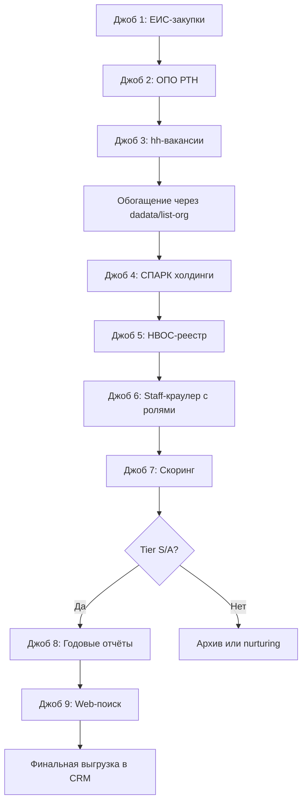

# Сводный план: от исследования к действию

## 1. ТОП-источники (ранжированы ценность/трудоёмкость)

### Tier S — запускать первым делом

| Источник | Ценность | Трудоёмкость | Что даёт |
|----------|----------|--------------|----------|
| **Закупки ЕИС** | 10/10 | Средняя | Горячие лиды + ЛПР-контакты + марки оборудования |
| **Реестр ОПО РТН** | 9/10 | Средняя | Подтверждение оборудования + география активов |
| **Вакансии hh.ru** | 8/10 | Низкая | Активная эксплуатация + структура служб |

### Tier A — подключать после отладки первых

| Источник | Ценность | Трудоёмкость | Что даёт |
|----------|----------|--------------|----------|
| **Сайты (страницы Сотрудники)** | 8/10 | Низкая (уже есть) | Прямые контакты ЛПР |
| **Холдинговые деревья (СПАРК)** | 7/10 | Средняя | Полнота охвата группы |
| **НВОС I категории** | 6/10 | Низкая | Крупные промплощадки |

### Tier B — расширение базы

| Источник | Ценность | Трудоёмкость |
|----------|----------|--------------|
| **Годовые отчёты ПАО** | 6/10 | Высокая |
| **Лицензии РТН** | 5/10 | Средняя |
| **xmlriver веб-поиск** | 5/10 | Средняя |

**Приоритет внедрения:**
```
НЕДЕЛЯ 1-2: ЕИС-парсер + ОПО-парсер + hh-скан
НЕДЕЛЯ 3: Интеграция СПАРК API (холдинги)
НЕДЕЛЯ 4: НВОС-реестр + улучшение staff-краулера
МЕСЯЦ 2: Годовые отчёты + расширенный веб-поиск
```

---

## 2. Целевой список: с чего начать

### Холдинги-ядро (приоритет 1)

**Газовая отрасль:**
- Газпром (дочки: Газпром трансгаз [все филиалы], Газпром добыча [Уренгой/Надым/Ямбург/Оренбург/Астрахань], Газпром переработка)
- Новатэк (Ямал СПГ, Арктик СПГ, Портэнерго)
- ЛУКОЙЛ (добывающие дочки)
- Роснефть (РН-Юганскнефтегаз, РН-Пурнефтегаз, Самотлорнефтегаз)
- Татнефть (НГДУ, Татнефть-Нефтехим)

**Химия и удобрения:**
- ФосАгро (Балаковские удобрения, Череповецкий Азот, Апатит)
- Уралхим (Кирово-Чепецкий, Воскресенские минудобрения, Пермские минудобрения)
- Акрон (Великий Новгород, Дорогобуж)
- ЕвроХим (Невинномысский Азот, ЕвроХим-БМУ, Фосфорит)

**Нефтехимия:**
- СИБУР (Тобольск-Полимер, Томскнефтехим, Нижнекамскнефтехим, Воронежсинтезкаучук)
- ТАИФ (ТАНЕКО, Нижнекамский НПЗ)
- САФМАР (Уфаоргсинтез, Салаватнефтеоргсинтез)

**Металлургия:**
- НЛМК (Липецк, Алтай-Кокс, Стойленский ГОК)
- Северсталь (Череповец, ККХ)
- ММК (Магнитогорск, МКК)
- Евраз (ЗСМК, НТМК)

**Промышленные газы:**
- Линде Газ Рус
- Мессер
- Криогенмаш
- СибКриоГаз

### Отрасли-ядро (для массовой выгрузки по ОКВЭД)

1. **06.10 + 06.20** (добыча нефти/газа) — порог выручки 500 млн ₽
2. **49.50.21** (транспорт газа) — все компании
3. **19.20** (НПЗ) — все крупные
4. **20.14 + 20.15 + 20.16 + 20.17** (нефтехимия, удобрения, полимеры) — порог 1 млрд ₽
5. **20.11** (промгазы) — все
6. **24.10** (металлургия) — порог 1,5 млрд ₽
7. **37.00** (водоканалы) — порог 100 млн ₽, но обязательно сверка с ОПО/закупками

---

## 3. Роли-ЛПР: финальный канон под ЦБК

### Топ-10 ролей (приоритет для outreach)

| # | Роль | Код | Приоритет | Когда контактировать |
|---|------|-----|-----------|---------------------|
| 1 | Главный механик | `chief_mechanic` | ★★★★★ | Всегда первым, владелец парка |
| 2 | Главный энергетик | `chief_power_engineer` | ★★★★★ | Если компрессоры в энергоцехе (водоканалы, воздух) |
| 3 | Начальник компрессорной станции/цеха | `compressor_chief` | ★★★★★ | Газотранспорт, промыслы — прямой эксплуатант |
| 4 | Технический директор | `technical_director` | ★★★★☆ | Стратегические решения, модернизация |
| 5 | Директор по эксплуатации/надёжности | `maintenance_director` | ★★★★☆ | Крупные холдинги, программы замены оборудования |
| 6 | Зам. главного механика/энергетика | `deputy_chief_mechanic` | ★★★☆☆ | Если главмех недоступен |
| 7 | Начальник службы главного механика | `maintenance_head` | ★★★☆☆ | Координатор ремонтов |
| 8 | Инженер по надёжности/эксплуатации | `reliability_engineer` | ★★☆☆☆ | Подготовка ТЗ, дефектовка |
| 9 | Начальник отдела закупок/МТО | `procurement_head` | ★★☆☆☆ | Процедурный владелец, но не техническое решение |
| 10 | Генеральный директор | `ceo` | ★★☆☆☆ | Малые компании или финальный апрув |

### Дополнительные роли (15 в полном списке)

11. Начальник РМЦ (`repair_shop_head`)
12. Начальник установки (НПЗ/нефтехимия) (`plant_manager`)
13. Зам. директора по производству (`production_deputy`)
14. Менеджер по закупкам (`procurement_manager`)
15. Приёмная/секретариат (`reception`) — только для запроса контактов техслужб

**Правило best_for_outreach:**
- Если есть главмех/главэнерго/начальник КС → они в топ-3 автоматически
- Техдиректор попадает в топ-3, только если нет других технических ролей
- Закупки включаем в топ-3, только если технических контактов < 2
- Общий email (info@) никогда не попадает в best_for_outreach

---

## 4. Формула скоринга «центробеж-ценности»

### Псевдокод

```python
def calculate_cbk_score(company, contacts):
    score = 0
    
    # Блок 1: ОТРАСЛЕВАЯ РЕЛЕВАНТНОСТЬ (0-30)
    okved_scores = {
        '06.10': 30, '06.20': 30, '49.50.21': 30, '49.50.11': 30, '52.10.22': 30,  # Ядро А
        '19.20': 28, '20.14': 28, '20.15': 28, '20.16': 28, '20.17': 28,          # Ядро Б
        '20.11': 26, '24.10': 26, '19.10': 26,                                     # Ядро В
        '20.13': 20, '24.42': 20, '24.43': 20, '35.11': 20, '35.30': 20,          # Второй контур
        '37.00': 18, '36.00': 18,                                                  # Водоканалы
        '07.10': 15, '05.10': 15, '17.11': 15, '23.51': 15, '10.81': 15           # Периферия
    }
    score += max([okved_scores.get(okved, 0) for okved in company.okveds])
    
    # Блок 2: ФИНАНСОВАЯ СОСТОЯТЕЛЬНОСТЬ (0-20)
    revenue = company.revenue_mln_rub
    if company.okved_primary in ['37.00', '36.00']:  # Водоканалы — особый порог
        if revenue >= 1000: score += 20
        elif revenue >= 500: score += 15
        elif revenue >= 200: score += 10
        elif revenue >= 100: score += 5
    else:
        if revenue >= 10000: score += 20
        elif revenue >= 5000: score += 18
        elif revenue >= 2000: score += 15
        elif revenue >= 1000: score += 10
        elif revenue >= 500: score += 5
    
    if company.holding in TARGET_HOLDINGS:  # Газпром, СИБУР, Роснефть и т.д.
        score += 5
    score = min(score, 50)  # Cap блоков 1+2 = 50
    
    # Блок 3: ПОДТВЕРЖДЕНИЕ ОБОРУДОВАНИЯ (0-30)
    equipment_score = 0
    if company.has_rtn_opo: equipment_score += 15
    if company.has_purchases_cbk_3y: equipment_score += 12
    if company.has_rtn_license: equipment_score += 10
    if company.has_nvos_category_1: equipment_score += 8
    if company.has_vacancies_cbk: equipment_score += 8
    if company.has_annual_report_mention: equipment_score += 6
    if company.has_website_brand_mention: equipment_score += 5
    equipment_score = min(equipment_score, 30)
    score += equipment_score
    
    # Блок 4: КАЧЕСТВО КОНТАКТА (0-20)
    contact_scores = {
        'chief_mechanic': 20, 'chief_power_engineer': 20,
        'compressor_chief': 18, 'maintenance_director': 18,
        'technical_director': 16,
        'deputy_chief_mechanic': 14,
        'maintenance_head': 14,
        'reliability_engineer': 12,
        'procurement_head': 10,
        'ceo': 8,
        'reception': 3,
        'unknown': 2
    }
    
    best_contact_score = 0
    for contact in contacts:
        role_score = contact_scores.get(contact.role, 0)
        if contact.has_full_name: role_score += 3
        if contact.source_page == 'staff': role_score += 2
        if contact.has_mobile: role_score += 2
        role_score = min(role_score, 20)
        best_contact_score = max(best_contact_score, role_score)
    
    score += best_contact_score
    
    # МНОЖИТЕЛЬ: Горячий сегмент (импорт без сервиса)
    hot_multiplier = 1.0
    if (company.has_import_zip_purchases_2y or 
        company.website_mentions_import_substitution or
        company.vacancies_mention_import_brands):
        hot_multiplier = 1.3
    
    final_score = score * hot_multiplier
    return round(final_score, 1)
```

### Пороги отсечки

```python
def get_priority_tier(score):
    if score >= 90: return 'S'  # Немедленный персональный контакт
    if score >= 70: return 'A'  # Приоритетная обработка, неделя
    if score >= 50: return 'B'  # Плановая обработка, месяц
    if score >= 30: return 'C'  # Отложенная, nurturing
    return 'D'  # Архив
```

---

## 5. Правила подтверждения «именно центробеж» и анти-сигналы

### Сигналы-подтверждения (что искать)

**Прямые (вес 10/10):**
- Марки: К-250, ЦК, 32ВЦ, НЦ, ГПА-Ц, Siemens STC, Dresser-Rand, Baker Hughes, MAN RG, Elliott, Mitsubishi
- Технологические установки: ЭП (пиролиз), агрегат аммиака, ВРУ, каткрекинг, ДКС, СПГ
- Термины в закупках: "центробежный компрессор", "нагнетатель", "турбокомпрессор", "динамический компрессор"

**Косвенные (вес 7-9/10):**
- ОПО типа "компрессорная станция", "станция воздухоразделительная"
- Вакансии: "машинист технологических компрессоров", "машинист ГПА", "механик компрессорного цеха"
- Закупки специфичных узлов: "сменный ротор", "импеллер", "сухое газовое уплотнение (СГУ)", "антисрывная система"

### Анти-сигналы (фильтры отсечения)

**Исключить, если:**

| Анти-сигнал | Действие | Балл |
|-------------|----------|------|
| Только винтовые марки (Atlas Copco GA, Comprag, Dalgakiran) без упоминания центробежных | Исключить | -10 |
| Закупки содержат ТОЛЬКО "винтовой блок", "винтовая пара", "поршневая группа" | Исключить | -10 |
| Производительность в закупках до 50 м³/мин + давление до 10 бар | Понизить приоритет | -5 |
| Выручка < 300 млн (не водоканал) И нет ОПО И нет закупок ЦБК | Исключить | -15 |
| ОКВЭД 28.13/33.12 И роль в ЕИС = "исполнитель ремонтов" (конкурент) | В реестр конкурентов | — |
| ОКВЭД 68.32/70.10 И название содержит "УК"/"Управление" И нет ОПО | Исключить (управляшка) | -10 |

**Правило комбинированного скоринга:**
```
IF (сумма баллов подтверждения >= 10) THEN метка = "ЦЕНТРОБЕЖНЫЕ_ПОДТВЕРЖДЕНЫ"
ELSE IF (сумма > 0 И нет анти-сигналов) THEN метка = "ВОЗМОЖНО_ЦЕНТРОБЕЖНЫЕ"
ELSE IF (есть анти-сигналы) THEN метка = "НЕ_ЦБК" → исключить
```

---

## 6. Конкретные СЛЕДУЮЩИЕ ДЕЙСТВИЯ для пайплайна

### Неделя 1-2: Фундамент (горячие источники)

**Джоб 1: ЕИС-парсер закупок**
```python
# server/jobs/parse_eis_purchases.py
import requests
from datetime import datetime, timedelta

TARGET_KEYWORDS = [
    "центробежный компрессор", "нагнетатель", "ГПА", "турбокомпрессор",
    "К-250", "ЦК-", "Siemens", "Dresser", "Baker Hughes", "MAN",
    "воздуходувка ТВ", "компрессор пирогаза", "антисрывная система"
]

def run():
    # API zakupki.gov.ru
    for keyword in TARGET_KEYWORDS:
        results = search_eis(
            query=keyword,
            date_from=datetime.now() - timedelta(days=365*3),
            customer_inn=None  # Сначала общий поиск
        )
        for purchase in results:
            extract_customer_inn(purchase)
            extract_contact_person(purchase)  # ФИО, email, телефон
            extract_subject(purchase)  # Предмет закупки
            detect_brand(purchase.subject)  # Какая марка упоминается
            save_to_db(purchase, source='eis', marker='cbk_confirmed')
```

**Выгрузка:** 5-10 тыс. компаний с подтверждённой потребностью за 3 года

---

**Джоб 2: ОПО-парсер Ростехнадзора**
```python
# server/jobs/parse_rtn_opo.py
from playwright.sync_api import sync_playwright

def run():
    # Парсинг https://www.gosnadzor.ru/industrial/reestr/
    # Поиск по ключевым словам в названии ОПО
    TARGET_OPO_TYPES = [
        "компрессорная станция", "станция воздухоразделительная",
        "цех компрессии", "установка утилизации ПНГ", "ГПА"
    ]
    
    with sync_playwright() as p:
        browser = p.chromium.launch()
        page = browser.new_page()
        
        for region in REGIONS:  # Все регионы РФ
            page.goto(f"https://gosnadzor.ru/reestr?region={region}")
            for opo_type in TARGET_OPO_TYPES:
                results = page.query_selector_all(f"text={opo_type}")
                for result in results:
                    extract_company_inn()
                    extract_opo_address()
                    save_to_db(marker='opo_confirmed')
```

**Выгрузка:** 3-5 тыс. компаний с зарегистрированными ОПО

---

**Джоб 3: hh-скан вакансий**
```python
# server/jobs/parse_hh_vacancies.py
import requests

HH_API = "https://api.hh.ru/vacancies"
TARGET_POSITIONS = [
    "машинист компрессорных установок",
    "машинист технологических компрессоров",
    "машинист ГПА",
    "механик компрессорного цеха",
    "инженер по эксплуатации компрессорного оборудования"
]

def run():
    for position in TARGET_POSITIONS:
        response = requests.get(HH_API, params={
            'text': position,
            'per_page': 100,
            'period': 30  # За последний месяц
        })
        for vacancy in response.json()['items']:
            company_inn = resolve_company_inn(vacancy['employer']['name'])
            extract_contact_hr(vacancy)
            detect_equipment_brands(vacancy['description'])  # Искать марки в описании
            save_to_db(marker='vacancies_cbk')
```

**Выгрузка:** 1-2 тыс. компаний с активной эксплуатацией

---

### Неделя 3: Холдинги и обогащение

**Джоб 4: СПАРК-интеграция (холдинговые деревья)**
```python
# server/jobs/enrich_holdings.py
from spark_api import SparkClient  # Коммерческий API

TARGET_HOLDINGS = [
    "ГАЗПРОМ", "РОСНЕФТЬ", "СИБУР", "НОВАТЭК", "ЛУКОЙЛ", "ТАТНЕФТЬ",
    "ФОСАГРО", "УРАЛХИМ", "АКRON", "ЕВРОХИМ", "НЛМК", "ММК", "СЕВЕРСТАЛЬ"
]

def run():
    client = SparkClient(api_key=SETTINGS['spark_api_key'])
    
    for holding in TARGET_HOLDINGS:
        tree = client.get_holding_tree(holding_name=holding)
        for subsidiary in tree.subsidiaries:
            if subsidiary.okved in TARGET_OKVEDS:
                enrich_from_spark(subsidiary)
                mark_as_holding_member(subsidiary, parent=holding)
                save_to_db()
```

**Выгрузка:** +2-3 тыс. дочек холдингов, пропущенных по основному ОКВЭД

---

**Джоб 5: НВОС-реестр**
```python
# server/jobs/parse_nvos.py
# Выгрузка реестра объектов НВОС I категории с сайта Росприроднадзора
# https://rpn.gov.ru/open-service/negate-impact/

def run():
    download_excel_by_region()
    for company in excel_data:
        if company.nvos_category == 'I':
            cross_check_with_db(company.inn)
            add_flag('nvos_category_1')
```

**Выгрузка:** Обогащение существующей базы флагом НВОС

---

### Неделя 4: Контакты и скоринг

**Джоб 6: Улучшенный staff-краулер (уже частично есть)**
```python
# server/enrich_contacts.py — UPGRADE
# Добавить:
# 1. Роль-детектор по регулярным выражениям (линза 02)
# 2. Приоритизация best_for_outreach (линза 02, раздел 4)
# 3. Извлечение из JSON-LD schema.org/Person

def classify_role(position_text):
    # Реализация паттернов из линзы 02
    for role_code, patterns in ROLE_PATTERNS.items():
        if any(re.search(p, position_text, re.I) for p in patterns):
            return role_code
    return 'unknown'

def select_best_for_outreach(contacts):
    # Логика из линзы 02, раздел 4
    priority = ['chief_mechanic', 'chief_power_engineer', 'compressor_chief', ...]
    return sorted(contacts, key=lambda c: priority.index(c.role) if c.role in priority else 999)[:3]
```

---

**Джоб 7: Скоринг всей базы**
```python
# server/jobs/score_leads.py
from scoring import calculate_cbk_score, get_priority_tier

def run():
    for company in db.get_all_companies():
        contacts = db.get_contacts(company.id)
        score = calculate_cbk_score(company, contacts)
        tier = get_priority_tier(score)
        
        db.update(company.id, {
            'cbk_score': score,
            'priority_tier': tier,
            'scored_at': datetime.now()
        })
        
        # Флаги для фильтрации
        if score < 30:
            db.mark_as('low_priority')
        if company.has_competitor_markers():
            db.move_to_competitors_list()
```

---

### Месяц 2: Расширенные источники

**Джоб 8: Годовые отчёты (PDF-парсинг)**
```python
# server/jobs/parse_annual_reports.py
import pdfplumber
import requests

def run():
    for company in db.get_companies(tier=['S', 'A']):  # Только приоритетные
        report_url = find_annual_report(company.website)
        if report_url:
            pdf = download_pdf(report_url)
            text = extract_text_from_pdf(pdf)
            
            # Поиск упоминаний
            if detect_cbk_mentions(text):  # ЭП-300, К-250, Siemens и т.п.
                company.add_flag('annual_report_mention')
                extract_equipment_list(text)  # Структурированное извлечение
```

---

**Джоб 9: xmlriver/Brave поиск**
```python
# server/jobs/web_search_enrichment.py
from xmlriver import XMLRiverClient

SEARCH_QUERIES = [
    '"{company_name}" центробежный компрессор',
    '"{company_name}" модернизация ГПА',
    '"{company_name}" Siemens компрессор',
]

def run():
    for company in db.get_companies(tier=['A', 'B']):
        for query_template in SEARCH_QUERIES:
            query = query_template.format(company_name=company.name)
            results = xmlriver_search(query)
            
            for result in results:
                if detect_brand_mention(result.snippet):
                    company.add_flag('website_brand_mention')
                    save_source_url(result.url)
```

---

### Порядок запуска (последовательность)



---

## Резюме: от 0 до первых лидов за 2 недели

**День 1-3:**
- Настроить API: zakupki.gov.ru, hh.ru, dadata, СПАРК
- Написать парсеры ЕИС + hh (используя готовые библиотеки)

**День 4-7:**
- Запустить выгрузку по ОКВЭД ядра (06.10, 06.20, 49.50.21, 19.20, 20.14-17, 20.11, 24.10)
- Порог выручки: 1 млрд для нефтегаза/химии, 500 млн для металлургии, 100 млн для водоканалов
- Обогащение через dadata (ИНН, адрес, выручка, ОКВЭД)
- **Получено:** 10-15 тыс. компаний (широкая воронка)

**День 8-10:**
- Сверка с ОПО РТН (парсинг или запрос выгрузки)
- Парсинг ЕИС по ключевым словам (закупки ЦБК за 3 года)
- **Получено:** 3-5 тыс. компаний с подтверждённым оборудованием

**День 11-14:**
- Staff-краулер по сайтам топ-1000 компаний (S/A-tier после первичного скоринга)
- Роль-классификация контактов (regex + Fable для unknown)
- **Получено:** 500-1000 прямых контактов ЛПР (главмех, главэнерго, начальник КС)

**День 15:**
- Скоринг всей базы
- Выгрузка S-tier (ожидаемо 200-300 компаний) → в CRM для немедленной обработки
- Выгрузка A-tier (500-700 компаний) → планирование кампаний

**Месяц 2:**
- Углубление: холдинговые деревья, годовые отчёты, веб-поиск
- Регулярное обновление: новые закупки, вакансии, изменения в ОПО

**Ожидаемые результаты через 2 недели:**
- 10-15 тыс. компаний в широк